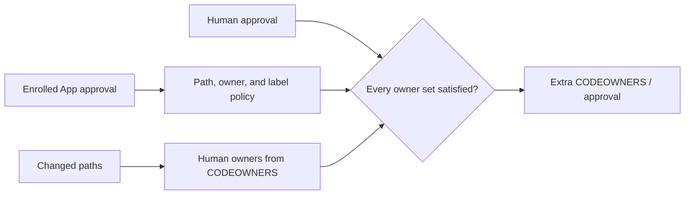

# Extra CODEOWNERS

[](https://github.com/stampbot/extra-codeowners/actions/workflows/ci.yml)
[](https://github.com/stampbot/extra-codeowners/actions/workflows/property-tests.yml)
[](https://stampbot.github.io/extra-codeowners/)
[](https://github.com/stampbot/extra-codeowners/actions/workflows/codeql.yml)
[](https://scorecard.dev/viewer/?uri=github.com/stampbot/extra-codeowners)
[](https://extra-codeowners.readthedocs.io/)
[](https://www.python.org/)
[](LICENSE)

Extra CODEOWNERS is a self-hosted GitHub App for repositories that want trusted
automation to satisfy a narrow code-owner obligation. People and teams stay in
the standard `CODEOWNERS` file. Applications and the paths they may approve
live in separate policy.

[Stampbot](https://github.com/dannysauer/stampbot) is the first use case. A
repository could let Stampbot approve a routine `uv.lock` update while a human
still owns changes to application code, workflows, and Stampbot's own policy.

> [!CAUTION]
> Extra CODEOWNERS is alpha software. Do not replace GitHub's native **Require
> review from Code Owners** rule on a production repository yet. GitHub attaches
> a Check Run to a commit rather than to one pull request, which leaves an
> unresolved stale-success window when the same commit appears in another pull
> request. [Issue #1](https://github.com/stampbot/extra-codeowners/issues/1)
> tracks the live proof and fix. Neither releases nor public images are
> supported, and there is no hosted service or Marketplace Action. An older
> public GHCR preview remains discoverable; do not deploy it. See the
> [current project status](docs/reference/project-status.md) before testing it.

## Why a separate check?

GitHub's code-owner rule understands people and teams. An App's bot account is
not a valid owner, and adding one can make GitHub reject the affected
`CODEOWNERS` line. Extra CODEOWNERS leaves that file alone.

Instead, it combines three sources of evidence:

1. `CODEOWNERS` says which people and teams own each changed path.
2. Organization policy enrolls a GitHub App by its numeric App ID, bot user ID,
   and public slug.
3. Repository policy delegates selected paths and owner groups to that App. A
   delegation may also require or forbid labels.

The App then checks reviews for the pull request's current head and publishes
`Extra CODEOWNERS / approval`.



The checker does not submit reviews, grant an App write access, or change the
repository's ordinary approval count. It evaluates reviews that already exist.
The intended repository rule is therefore:

```text
ordinary required approvals
AND Extra CODEOWNERS / approval
AND every other required check
```

Only GitHub's native code-owner-review requirement is replaced. For now, test
that composition in a disposable repository and keep native enforcement in
production.

## Policy in two places

The organization decides which applications are eligible. In the
organization's `.github` repository, `.github/extra-codeowners.toml` enrolls
the App:

```toml
schema_version = 1

[apps.stampbot]
slug = "stampbot"
app_id = 123456
bot_user_id = 234567
```

Replace both example IDs with values reported by GitHub. Enrollment alone does
nothing to member repositories.

A repository opts in with its own `.github/extra-codeowners.toml`:

```toml
schema_version = 1
enabled = true

[[delegations]]
app = "stampbot"
paths = ["/uv.lock"]
for_owners = ["@example-org/platform"]
required_labels = ["dependencies"]
```

This delegation applies only when Stampbot approves the current head, the
change is `/uv.lock`, the standard `CODEOWNERS` result includes
`@example-org/platform`, and the pull request has the `dependencies` label.
The [configuration guide](docs/how-to/configure.md) shows how to obtain the
IDs, add organization guardrails, validate both files, and run negative tests.

## Security defaults

Applications cannot stand in for a human on files that define or execute the
approval boundary. The built-in list covers every supported `CODEOWNERS`
location, the repository policy, `/stampbot.toml`, GitHub Actions workflows,
and repository-local actions. Organization policy can add more paths.

`EXTRA_CODEOWNERS_ALLOW_INSECURE_CHANGES=true` removes the built-in list for
every installation served by that process. Organization guardrails remain,
but this still changes the trust model for all served repositories. Read the
[threat model](docs/explanation/threat-model.md#what-the-insecure-changes-escape-hatch-changes)
before enabling it.

## Run the service locally

You need Git, [mise](https://mise.jdx.dev/), and a POSIX-compatible shell.
Review `mise.toml` before trusting it, then run these commands from the
repository root:

```bash
mise trust
mise install
mise run bootstrap
mise exec -- uv run python -m extra_codeowners database migrate
mise exec -- uv run python -m extra_codeowners serve
```

The development server listens on `127.0.0.1:8000`. In another terminal, check
its liveness:

```bash
curl --fail-with-body http://127.0.0.1:8000/health/live
```

A process without GitHub credentials can be alive but not ready. The liveness
request should return HTTP 200 and output like this:

```json
{"status":"alive","worker":true,"reconciler":true}
```

To process a real test pull request, the service needs a development GitHub
App, policy files, and a public HTTPS webhook URL. The
[development installation tutorial](docs/tutorials/development-installation.md)
walks through that path in a disposable repository.

Run the local pull-request checks with:

```bash
mise run check
```

The command should finish without a failed task. PostgreSQL-backed coverage
tests need a separate disposable database; the tutorial explains that setup.

## Find the right documentation

| If you want to... | Start here |
| --- | --- |
| Decide whether the trust model fits | [Native CODEOWNERS comparison](docs/explanation/native-codeowners.md) and [threat model](docs/explanation/threat-model.md) |
| Build a development installation | [Development installation tutorial](docs/tutorials/development-installation.md) |
| Enroll an App and delegate paths | [Configuration guide](docs/how-to/configure.md) |
| Test repository rules safely | [Repository-rules guide](docs/how-to/prepare-repository-rules.md) |
| Plan an evaluation or inspect the future operations contract | [Future-deployment guide](docs/how-to/deploy.md) and [operations guide](docs/how-to/operate.md) |
| Look up exact behavior | [Configuration](docs/reference/configuration.md), [checks](docs/reference/checks.md), [CLI](docs/reference/cli.md), and [HTTP API](docs/reference/http-api.md) references |
| Understand the implementation | [Architecture](docs/explanation/architecture.md) |

The complete documentation is published on
[Read the Docs](https://extra-codeowners.readthedocs.io/).

## Project and community

This repository contains the GitHub App, policy evaluator, database migrations,
and Helm chart source. Python imports are not a stable public API before 1.0.
The planned `extra-codeowners-action` distribution does not exist yet.

- Ask for help through the [support policy](SUPPORT.md).
- Report vulnerabilities privately under the [security policy](SECURITY.md).
- Read [CONTRIBUTING.md](CONTRIBUTING.md) before sending a change.
- See the [changelog](CHANGELOG.md), [governance](GOVERNANCE.md), and
  [Apache-2.0 license](LICENSE) for project details.
