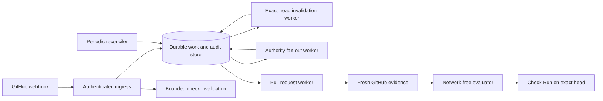
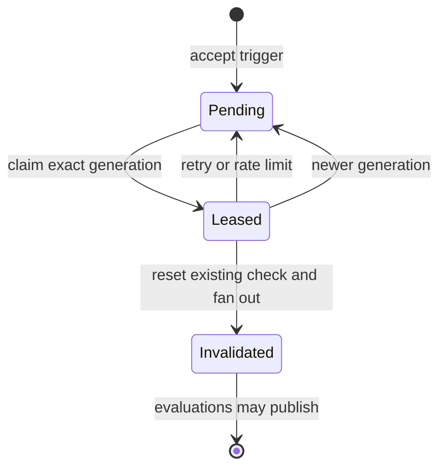
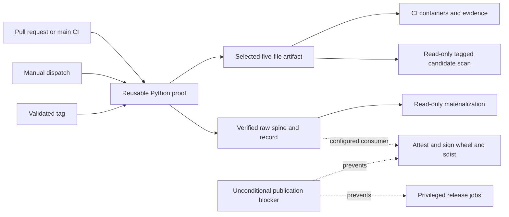

# Architecture

Extra CODEOWNERS has to react quickly when approval evidence changes, yet it
must not turn a partial view of GitHub into permission to merge. The service
handles those goals on separate paths: a bounded fast path tries to revoke an
old success immediately, while a durable worker performs the authoritative
evaluation.

This page describes the self-hosted GitHub App that exists today. The planned
Marketplace Action and hosted service are separate distributions.

## Design rules

The implementation follows four rules:

1. Store relevant work before acknowledging the webhook.
2. Fetch authorization evidence from GitHub; never trust a webhook payload as
   proof that a review or policy is valid.
3. Keep the policy evaluator deterministic and independent of the network and
   database adapters.
4. Let missing, stale, truncated, or contradictory evidence block success.

## From event to decision



In words, ingress authenticates and stores a trigger. A direct pull-request
trigger also gets a short opportunity to move the managed check back to
`in_progress`. Changes with wider authority impact—such as team membership,
policy, repository identity, or installation scope—enter a fan-out queue.

The durable worker drains exact-head invalidation first. That phase resets an
existing managed check on the affected commit and queues every returned
candidate that is still open on that commit. Authority fan-out runs next.
Ordinary pull-request work then fetches the current base, head, changed files,
reviews, team state, CODEOWNERS, and both policy scopes. The pure evaluator
returns a decision and explanation. The worker publishes only after proving
that the revisions, queue generation, completed invalidation, and authority
state are still current.

The scheduled reconciler supplies work for accessible open pull requests that
have gone idle. It is recovery for a missed event, not a source of stronger
consistency.

## Webhook ingress

`/webhooks/github` verifies the HMAC-SHA256 signature over the raw request body
before parsing any field that can affect authorization. For mapped events,
`X-GitHub-Delivery` is the deduplication key.

Ingress records a direct delivery, its pull-request work, and a pending
revocation for the payload's exact head in one database transaction. The
delivery also remembers the exact shared-head generation it created. A
redelivery gets that same token; it cannot borrow a newer generation.

Repeated triggers for one installation, repository, and pull request coalesce
behind a generation counter. The shared-head generation is separate because a
Check Run belongs to a commit, not to one pull request. An older worker cannot
delete new work or replace another pull request's revocation with stale
evidence.

Direct pull-request, review, and check-rerequest events use a bounded fast path.
After the durable transaction commits, ingress fetches the current pull request
and tries to reset the App's check on the accepted head to `in_progress`. The
generation token prevents a delayed handler from resetting a newer completed
result. If the pull request already moved to another head, ingress records
separate work for the live head and keeps the accepted head's revocation.

The fast path updates an existing managed check even when policy has
disappeared. It creates a check only when the accepted head is still the
current head of an open pull request and policy exists. A closed or historical
head with no managed check stays untouched.

The fast path is best effort. Its timeout is bounded by
`EXTRA_CODEOWNERS_WEBHOOK_INVALIDATION_TIMEOUT_SECONDS` and remains below
GitHub's delivery deadline. Once work is safely stored, an API error or timeout
is logged and counted, but ingress still returns `202`. The exact-head
invalidation worker remains authoritative.

Authority events need stricter ordering. Before an installation-wide authority
epoch can advance, ingress acquires a database-backed publication guard. If it
cannot obtain the guard within the same configured timeout, it returns `503`
without accepting the event. The operator must redeliver that event after the
database or lock recovers. GitHub
[does not automatically redeliver failed webhooks](https://docs.github.com/en/webhooks/using-webhooks/handling-failed-webhook-deliveries).

An authentic event does not always imply work. Unmapped actions are
acknowledged without retention, and the App's own check updates do not feed
back into its queue. If the process has no evaluator, it stores a mapped direct
delivery but returns `503`; it cannot claim the work will converge without a
worker.

## Durable exact-head invalidation

Each shared-head row carries two generation values. `generation` is the newest
accepted work. `invalidated_generation` is the newest generation whose exact
Check Run reset and pull-request fan-out finished. A gap between them is
durable queue work.



Workers claim this queue before authority fan-out or ordinary evaluation. The
claim has a renewable lease. Before the worker sends a mutating GitHub request,
it checks the lease owner, expiry, and generation while holding the
installation-and-head writer guard. A replacement owner or newer generation
therefore fences the old worker before its reset.

The worker looks up the existing Check Run by App, name, repository, and exact
head, then updates that run by ID. It never creates a check while processing a
historical head. If no managed check exists, the revocation finishes without a
GitHub write. There is nothing to reset.

Next, the worker asks GitHub which pull requests use the commit. It rejects
malformed or contradictory responses. It fetches every returned candidate and
confirms its current number, state, head, and base repository. The worker
queues only candidates that are now open on the exact commit, at the same
shared generation. A pull request that has moved to another head keeps its
newer work.

The client paginates the commit-to-pulls endpoint and fails closed if GitHub
returns a 101st candidate. GitHub does not provide a completeness marker, so
the worker cannot detect an omitted pull request. Every returned candidate gets
an authoritative read; the candidate set itself remains a provider assumption
that issue #1 must test on live GitHub.

Failures remain pending with bounded backoff, and GitHub rate limits use their
own delay. An evaluation can publish only when its captured generation equals
both the current generation and `invalidated_generation`. This makes the
revocation a prerequisite, not a best-effort side effect.

## Durable authority ordering

Some changes can affect many pull requests at once. Authority work coalesces at
three scopes:

1. installation
2. repository
3. base ref.

Workers claim the broadest scope first. An installation job splits itself into
durable per-repository fences before it finishes, so one repository's retry
does not delay every other repository. A repository-wide fence supersedes
older base-ref rows.

The base-ref queue is bounded. A repository may retain 100 distinct base-ref
rows; the next one collapses them into one conservative repository job. A
contributor can make reevaluation broader, but cannot grow that queue without
limit or make the work disappear.

Repository routes are mutable names, so each job also records the
installation's authority epoch at enqueue time. A repository rename, transfer,
or installation-owner change advances the epoch before rediscovery. Work under
the previous epoch remains stale permanently, even after the fan-out job has
finished.

Late webhooks can still carry an old repository name. Before reading policy or
writing a check, the worker compares the queued route with the base repository
identity GitHub currently reports for the pull request. An installation-and-head
publication guard provides the last ordering layer across repository names.
None of these controls can revoke a success after a transfer or installation
change has already removed the App's access.

The organization-policy repository receives special treatment. If it leaves
the installation—or if removal evidence is malformed—the service schedules
installation-wide reevaluation for every target it can still reach. A
well-formed removal of an ordinary target repository is acknowledged without
pretending the App can update a repository it can no longer access.

## Pull-request worker

For each job, the worker first fetches the current revisions and moves the
named check on that head to `in_progress`. It then confirms that it owns the
newest database generation before collecting mutable reviews, labels,
membership, and policy.

The worker obtains a short-lived installation token and asks the GitHub adapter
for authoritative evidence. It passes an immutable snapshot to the evaluator,
then applies several publication fences:

- the base and head still match
- the pull-request generation is still current
- the shared generation for the head commit is still current
- the same shared generation has finished exact-head invalidation
- the enqueue-time authority epoch is still current
- no relevant authority fan-out remains pending or retrying
- the publication guard permits this write.

The worker checks the pull-request claim and shared generation while it holds
the same head-level guard used for Check Run writes. Shared-head discovery can
take many GitHub calls, so it checks the pull-request claim again immediately
before publishing.

A completed write can have an uncertain outcome when the client raises or is
cancelled: GitHub may have applied the result before the response was lost.
After a completed write returns, the worker rechecks both the claim and shared
generation. An uncertain write, lost claim, changed generation, database error,
or task cancellation triggers a shielded reset to `in_progress` before the
guard is released. The original error remains retryable.

The queued head can be stale, and the final pull-request read can uncover a
missed head, base, or label change. In either case, the worker advances the
live head's shared generation and queues replacement work in one transaction.
That makes every older claim for the commit stale, including claims held by
workers evaluating another pull request.

That reset is still a GitHub API request. A hard process stop can interrupt it,
and GitHub can reject or time it out. In either case, a completed result may
remain visible until fast invalidation or durable retry reaches GitHub.

Pull-request and authority failures stay pending. They retry indefinitely with
exponential backoff capped by
`EXTRA_CODEOWNERS_WORKER_RETRY_MAX_SECONDS`. A provider rate limit instead uses
GitHub's separately bounded `Retry-After` value and does not advance ordinary
backoff. Abandoning a transient failure could strand an earlier success, so
there is no terminal “give up” state for authorization work.

## Reconciler

Webhooks are a change signal, not a complete recovery system. The endpoint may
be unavailable, GitHub may not redeliver, and access loss can make an old check
unreachable. The reconciler covers the recoverable middle ground.

At each interval, one elected reconciler scans accessible open pull requests.
When a pull request has no evaluation job and GitHub supplies a canonical head,
one transaction advances that head's shared generation, makes its exact-head
invalidation pending, and inserts the evaluation. If the internal job did not
know its head when queued, its first authoritative pull-request read advances
the head and binds the evaluation in one transaction. A lost claim rolls back
that tentative advancement.

If an evaluation row already exists, reconciliation changes neither row nor
generation. This fences an in-flight evaluation when reconciliation recovers
genuinely missing work without resetting active or backoff-delayed jobs. An
idle pull request is reconsidered each interval, which temporarily moves its
check to `in_progress`.

The same singleton lease controls pruning of delivery IDs and old shared-head
rows. A shared-head row is eligible only after its latest generation was
invalidated, no evaluation references it, and no invalidation lease remains.
The elected process runs both retention tasks before it asks GitHub for the
installation list, so a discovery failure does not postpone cleanup. A
background heartbeat renews the lease while a scan runs.

GitHub's `Link` header controls pagination when it is present. The client
validates that each `rel="next"` URL keeps the same origin, endpoint, and every
query parameter except `page`, which must advance by exactly one. For array
responses without a count, a 100-record page triggers a compatibility request
only when GitHub omits the header. Repository discovery instead requires a
nonnegative `total_count` that stays unchanged across pages. Without a next
link, repository discovery requests another page only when the current page
has 100 records and that count remains unsatisfied. The client rejects a
terminal result that disagrees with the count. Duplicate installation IDs,
repository names, or pull-request numbers also fail validation.

If the heartbeat loses the lease, the service records a partial attempt. It
does the same when it cannot safely scan an installation or queue its pull
requests. Work already queued remains durable. Only a complete scan advances
the last-success timestamp. The organization-policy repository is never
included in reconciliation.

Shutdown before a scan begins records no attempt, including when election is
still in progress. If that election acquired the singleton lease, the process
releases it before returning. A release error is an election failure rather
than an idle shutdown. Shutdown during a scan records a partial result. Once a
scan begins, either shutdown or lease loss stops further discovery. The
reconciler checks both conditions between retention operations, after each
GitHub response and before the next page, and before each repository scan and
queue insertion. An insertion that already committed remains queued. After a
boundary observes either condition, no later reconciliation discovery or queue
operation starts; lease-heartbeat shutdown and final bookkeeping still run.
The reconciler does not cancel the GitHub or database operation already in
progress. A GitHub request has a 20-second wall-clock deadline. PostgreSQL
connect, pool, and statement waits use the fixed limits in
[Runtime configuration](../reference/configuration.md); a multi-statement
operation and local cleanup can add time after the current wait.

Because the installation list defines the scope of the whole scan, the
reconciler validates every record before processing any installation. One
malformed installation record fails the attempt; the reconciler does not
process the valid records around it. Repository and open pull request lists are
scoped to one installation. Malformed data in either list fails that
installation, but later installations still run. A suspended installation or
archived repository is skipped only after its record passes validation.

A shorter interval narrows some missed-event windows but spends more GitHub API
budget and causes more temporary blocking. It does not make the system strongly
consistent. Merge queues add a separate `merge_group` state that this version
does not evaluate.

## Pure evaluator

The evaluator imports no GitHub or database behavior. It accepts typed evidence
and then:

1. parses the standard CODEOWNERS file
2. compiles organization enrollment and repository delegation policy
3. reduces each actor's reviews to the latest opinionated review
4. groups changed paths by effective owner set
5. tests each group against eligible human and delegated App evidence.

That network-free boundary makes property tests and adversarial fixtures
practical. It also gives future distributions one semantic core to reuse.

The Python modules are not a stable public API before 1.0. A future Action or
hosted service should call an intentionally versioned interface rather than
turning incidental internal imports into another compatibility contract.

## What a `202` means

A successful webhook response means that the trigger is durably queued. It is
not a merge decision.

```text
GitHub             ingress             durable store        workers
  | signed event      |                       |                 |
  |------------------>| verify and store      |                 |
  |                    |---------------------->| generation,     |
  |                    |                       | revocation, job |
  |<------------------| 202 after durable work|                 |
  |                    |                       |---------------> | reset exact-head check
  |<------------------------------------------------------------| PATCH existing check
  |                    |                       |---------------> | evaluate current PR
  |<------------------------------------------------------------| publish after all fences
```

Ingress attempts the quick invalidation before returning `202`. If the request
times out, GitHub may still apply it after the response. Either way, the durable
reset has to finish before an evaluation may publish. A completed result comes
only after fresh evidence and the final fences.

## Durable store and deployment

SQLite keeps local development simple. Production startup requires PostgreSQL
because all instances must share delivery deduplication, exact-head
invalidation progress, queue leases, retry state, authority and shared-head
generations, publication guards, and audit records.

PostgreSQL operations use fixed fail-fast budgets: three seconds to connect,
two seconds to obtain a pooled connection, and three seconds for an ordinary
statement. Advisory-lock operations replace the statement timeout with the
bounded guard wait for that operation. Database migrations are explicit and
versioned; normal startup never mutates the schema.

The latest audit record retains the triggering delivery ID and reason for
correlation. Audit data may reveal private repository names, paths, owners, and
decision details, and rows do not expire automatically. Treat the database as
private repository metadata, set an operator-owned retention policy, and
include it in access reviews. Installation tokens and App private keys never
belong there.

The deployed topology is conventional:

```text
public HTTPS load balancer
  -> one or more stateless Extra CODEOWNERS processes
       -> shared PostgreSQL
       -> api.github.com

secret manager
  -> App private key, webhook secret, temporary setup-state secret
```

Bound request size and rate before traffic reaches the service. Metrics and
health endpoints are operator surfaces; keep them on a controlled network or
behind authenticated monitoring.

## The remaining consistency boundary

GitHub stores a Check Run on a commit, while Extra CODEOWNERS evaluates one
pull request. Before success, the worker confirms that no other open pull
request currently uses the same head. A pull request opened or retargeted later
can still inherit the completed result until its event is accepted and the
check is invalidated.

Generation fences, authority epochs, the fast path, and reconciliation all
make that window smaller. They cannot turn a commit-scoped GitHub object into a
pull-request-scoped one. This mismatch is why the current project must not
replace native code-owner enforcement in production.

## Distribution boundaries

The repository contains the App, evaluator, migrations, and Helm chart source.
CI builds multi-platform candidates but does not publish a supported image or
chart.

CI, manual proof runs, and the tagged read-only scan call one reusable Python
proof workflow. Each caller builds its own proof inside its own run; no caller
trusts artifacts from a different workflow run.



Each caller gets a separate proof in its own run. CI keeps its required-check
wrapper, and the tagged scan downloads the selected artifact by immutable ID.
The reusable workflow also converts that selection into a [raw
Python-distribution
spine](../reference/python-distribution-spine-format.md). A separate read-only
job verifies the spine and atomically materializes its five files without
opening the wheel or source-distribution archives.

The tagged workflow also defines a privileged Python job that would materialize
the same files, attest and sign the two distributions, and retain the three
selection records. The unconditional publication blocker makes that job
unreachable. Its evidence artifact does not flow into the GitHub release job,
so issue #32 remains open.

The current container evidence binds CPython's top-level identity to exact
runtime files and retains its pinned recipe, source archive, and source-carried
license. It also replays historical Python installs from each layer's `RECORD`.
Greenlet now has closed-world coverage on both architectures: exact wheel and
sdist identity, complete native-file ownership, embedded-component identity,
Alpine GCC source, and reviewed notices. MarkupSafe and SQLAlchemy also bind
their exact wheels and sdists to complete native-payload sets. Both have no
embedded SBOM and explicitly treat their payloads as owner code. Four other
native-wheel owners retain structured open omissions for the surfaces that
still lack complete evidence.

The tagged workflow contains intended image, chart, Python, SBOM, provenance,
signature, and GitHub-release jobs. An unconditional blocker keeps every
privileged job unreachable. The repository also contains a dormant release
controller, publication API adapter, and read-only immutable-release preflight.
No workflow connects them or supplies their tokens.

Four issues describe the remaining release boundary:

- [#18](https://github.com/stampbot/extra-codeowners/issues/18): source and
  notice completeness
- [#28](https://github.com/stampbot/extra-codeowners/issues/28): privilege
  separation between untrusted parsing and publication
- [#32](https://github.com/stampbot/extra-codeowners/issues/32): retained
  application build-proof handoff
- [#25](https://github.com/stampbot/extra-codeowners/issues/25): first
  immutable release publication.

Workflow definitions are not evidence that an artifact exists. No supported
release has been published.

The planned `extra-codeowners-action` should run a prebuilt, signed container
and reuse the same evaluator and policy schema. A hosted service would add new
requirements—tenant isolation, abuse handling, privacy, billing, support, and
service objectives—but must not introduce a second authorization engine with
almost the same rules.
