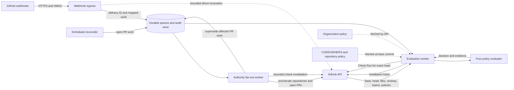

# Architecture

This page describes the initial implementation architecture. The GitHub App and core evaluator are under active development; hosted service and Marketplace Action components are roadmap items.

## Design goals

The architecture prioritizes four properties:

1. Relevant webhook delivery is stored durably before acknowledgement, with a bounded best-effort fast path to revoke a managed success immediately.
2. Authorization decisions use current GitHub evidence, not trusted webhook payload fields.
3. Policy evaluation is deterministic and independent of the network adapter.
4. Missing, stale, truncated, or contradictory evidence cannot produce success.

## Components

The following diagram shows the data path from GitHub events to a Check Run.



Text equivalent:

- Webhook ingress verifies GitHub's signature, deduplicates mapped deliveries, and transactionally records direct pull-request or authority fan-out work. For direct pull-request triggers, it also makes a bounded attempt to create or update the managed current-head check as `in_progress`. It does not perform the full evaluation inline.
- Authority fan-out handles base-branch, policy, label-definition, membership, team, organization, installation, repository-selection, and repository lifecycle changes. It identifies affected open pull requests, supersedes their evaluation jobs, and attempts bounded check invalidation.
- A scheduled reconciler adds absent work for open pull requests without superseding active or retrying jobs, so missed webhook events do not leave otherwise idle checks stale indefinitely.
- A worker obtains a short-lived installation token, moves the current-head check to `in_progress`, and fetches current pull-request evidence plus policy.
- A network-free evaluator returns a decision and structured evidence.
- The worker verifies that base, head, and database generation are unchanged, then publishes the completed check for the exact head commit and checks the generation once more for a publication race.

### Webhook ingress

The public `/webhooks/github` endpoint verifies the HMAC-SHA256 signature over the raw request body before parsing authorization-relevant fields. `X-GitHub-Delivery` is the deduplication key for mapped work. Acceptance of a mapped delivery and creation or update of its pull-request or authority job occur in one database transaction. For an installation-wide authority event, that transaction also advances a persistent installation authority epoch. Authority acceptance first waits for the database-backed installation publication guard, bounded by `EXTRA_CODEOWNERS_WEBHOOK_INVALIDATION_TIMEOUT_SECONDS` and below GitHub's delivery deadline. If that guard cannot be acquired, ingress returns `503` without recording the delivery; an operator must redeliver it after recovery. Authenticated events and actions the handler does not map are acknowledged without retention so the App's own check updates do not create a durable feedback loop.

For a mapped pull-request, review, or check-rerequest trigger, ingress then attempts to fetch the current pull request and policy. If policy exists, it creates or updates the managed check as `in_progress`; if policy is absent but this App already manages the named check on the current head, it updates that check to `in_progress`. A repository with no policy and no managed check is deliberately skipped. Broader authority events return after durable acceptance; their fan-out worker performs GitHub API work asynchronously.

The direct-trigger fast path is bounded by `EXTRA_CODEOWNERS_WEBHOOK_INVALIDATION_TIMEOUT_SECONDS`. After durable acceptance, a timeout or GitHub API error is logged and counted but still returns `202`; the queued worker remains authoritative and moves the check to `in_progress` before evaluating. This avoids crossing GitHub's 10-second delivery deadline, and GitHub [does not automatically redeliver failed webhooks](https://docs.github.com/en/webhooks/using-webhooks/handling-failed-webhook-deliveries). If no evaluator is configured at all, ingress returns `503` after storing the delivery because it cannot promise that any worker can process it. A manual duplicate redelivery can resume a still-pending direct-trigger invalidation. By contrast, an authority-guard timeout returns `503` before acceptance, so the original delivery must be redelivered after the lock or database problem is resolved.

Repeated triggers coalesce by installation, repository, and pull request. A generation counter prevents an older worker from deleting work that arrived while it was evaluating.

### Durable store

SQLite is the developer default; production startup requires PostgreSQL so multiple instances can share delivery deduplication, leased pull-request and authority work, retry state, and evaluation audit records. PostgreSQL connections, application-pool checkout, and ordinary statements use fixed fail-fast budgets of 3, 2, and 3 seconds respectively; advisory-lock statements use the bounded wait of the operation acquiring the guard. Pull-request jobs retain the most recent triggering delivery ID, and the latest audit records its trigger reason and delivery ID for correlation.

Authority jobs coalesce by installation, repository scope, and base ref. Claim order gives installation-wide work priority over repository-wide work and repository-wide work priority over base-specific pushes. An installation-wide job durably splits into repository-scoped fences before it completes, so one repository's retry does not prevent fan-out from reaching the others. Creating a repository-wide fence removes older base-specific rows for that repository. A repository retains at most 100 distinct base-ref rows; adding a 101st distinct ref collapses them into one conservative repository-wide fence, preventing contributor-controlled branch names from creating an unbounded queue without dropping reevaluation coverage.

Repository scopes still use mutable `owner/repository` routes, but every evaluation row stores the installation authority epoch that was current when it was enqueued. An accepted repository or installation-owner identity event advances that epoch before current repositories are rediscovered. Work already queued under an old name therefore remains permanently stale, even if it is first claimed after fan-out; new work uses the current name and epoch. A delayed old-name webhook could arrive after the epoch changed, so the worker also compares the queued route with the authoritative base repository full name and discards a mismatch before any Check Run or policy lookup. The installation-and-head publication guard serializes Check Run writes across names as a final ordering layer. These controls cannot repair a transfer or installation change that removes the App's access before it can update a check.

The elected reconciler prunes delivery IDs after the configured retention period. Database initialization reactivates terminal rows created by the earlier pre-release retry contract. Audit evidence can contain private repository names, paths, owners, and decision details, and audit rows are not automatically expired in the preview. Protect the database as private repository metadata, set an operator-owned retention policy, and include it in access reviews. The database must not store installation access tokens or GitHub App private keys.

### Worker

The worker processes two durable job types. For installation-wide authority work, it lists accessible repositories and creates an independently retryable repository authority job for each target. A repository authority job then lists affected open pull requests, creates or supersedes every pull-request job before attempting bounded parallel invalidation, and filters an ordinary repository push to pull requests whose base ref matches the pushed branch. Removing the configured organization-policy repository from the installation, or receiving malformed removal evidence, creates conservative installation-wide work for every target that remains accessible. A well-formed removal containing only ordinary targets is acknowledged without work because the App has already lost the capability needed to update those repositories.

For a pull-request job, the worker fetches the current revisions and moves the named current-head check to `in_progress` before collecting mutable review and label evidence. It verifies that its database generation is still current, fetches authoritative evidence, evaluates it, and posts a completed Check Run only for that generation. Evaluation and authority exceptions remain pending and retry indefinitely with exponential backoff capped by `EXTRA_CODEOWNERS_WORKER_RETRY_MAX_SECONDS`. GitHub rate limits use the provider's separately bounded `Retry-After` delay without advancing ordinary backoff. Terminal retry exhaustion would be unsafe: revocation or reevaluation work abandoned after a transient dependency failure could leave a stale success visible.

Per-pull-request generation checks before and after completion, plus a final base/head comparison, prevent an evaluation for older state from overwriting a newer decision. Each evaluation row records the current installation authority epoch when it is enqueued, and publication rejects a claim whose stored epoch is no longer current. That permanent fence still applies after the corresponding installation-wide authority job completes. A relevant unresolved authority job prevents a completed result as well, so an evaluation that started before any applicable authority event cannot publish through the fan-out window. Final Check Run publication and authority-webhook acceptance use a database-backed installation guard: normal evaluations can publish concurrently, but an authority event's durable epoch or fan-out is ordered wholly before or after each result. If a direct pull-request trigger commits while a completed check is being published, the worker immediately patches the check back to `in_progress`; the newer generation then reevaluates.

GitHub stores the Check Run on the head commit, while the service evaluates a specific pull request. Before success, the worker verifies that no other open pull request currently uses that head. A pull request opened or retargeted after publication can still inherit the existing commit result until its event is accepted and invalidated. Reconciliation recovers missed events but cannot make a commit-scoped check permanently pull-request-specific.

### Reconciler

Webhook delivery is not a complete reliability mechanism: an endpoint can be unavailable, GitHub does not automatically redeliver a failed webhook, and some installation-scope losses cannot be repaired after access disappears. The reconciler periodically discovers accessible open pull requests, creates work only when that pull request has no existing evaluation job, and prunes expired webhook delivery IDs while holding a database-coordinated singleton lease. Long runs renew the lease between installations. The configured organization-policy repository is excluded from reconciliation.

Reconciliation does not supersede active or backoff-delayed work. This avoids repeatedly resetting retry state or starving an evaluation when a scan takes longer than its interval; pending failures retry on their own schedule. An otherwise idle open pull request is reevaluated each interval, temporarily moving its check to `in_progress`. The interval is therefore a stale-evidence, merge-availability, and API-budget trade-off. Reconciliation limits how long stale success may remain visible but does not make the system strongly consistent. Merge-queue support must add evaluation of the `merge_group` state before high-assurance use with merge queues.

### Pure evaluator

The core evaluator accepts typed evidence and performs no GitHub or database calls. It parses CODEOWNERS, compiles organization and repository policy, reduces each actor to the latest opinionated review, groups changed paths by owner set, and evaluates human or delegated application evidence. This boundary makes adversarial and property-based testing practical.

The evaluator is shared implementation, not a stable public Python API before 1.0. Future distributions should reuse its tested semantics through an intentionally versioned interface rather than importing arbitrary internal modules.

## Evaluation sequence

The following sequence shows why a webhook response is not the final policy decision.

```mermaid
sequenceDiagram
    participant G as GitHub
    participant I as Ingress
    participant D as Durable store
    participant W as Worker
    participant E as Evaluator

    G->>I: Signed pull-request or review event
    I->>I: Verify raw-body signature
    I->>D: Record delivery and enqueue generation
    I->>G: Fetch current PR and managed check
    alt Policy exists or managed check exists and fast path succeeds
        I->>G: Create or update current-head check as in progress
        I->>D: Mark fast-path invalidation complete
    else No policy and no managed check
        Note over I,G: Deliberately skip unenrolled repository
        I->>D: Mark fast-path invalidation complete
    else Fast path times out or GitHub is unavailable
        Note over I,D: Log deferral; durable job remains authoritative
    end
    I-->>G: Accepted
    W->>D: Lease latest PR generation
    W->>G: Fetch current base and head
    W->>G: Set current-head check in progress
    W->>D: Confirm generation is current
    W->>G: Fetch installation-scoped current evidence
    G-->>W: Base, head, files, reviews, teams, policy
    W->>E: Typed immutable snapshot
    E-->>W: Decision and evidence
    W->>G: Re-fetch base and head
    W->>D: Confirm generation is current and authority work is resolved
    alt Base or head changed
        W->>D: Request a newer generation
    else Generation was already superseded
        Note over W,G: Keep check in progress for newer work
    else Relevant authority work is pending
        Note over W,G: Keep check in progress until fan-out recovers
    else Snapshot is current
        W->>G: Complete Check Run on head
        W->>D: Confirm generation after publication
        alt Superseded during publication
            W->>G: Restore check to in progress
        else Generation is still current
            W->>D: Complete job and record audit
        end
    end
```

Text equivalent: ingress authenticates and persists the trigger, then makes a bounded attempt to create or update the managed check as blocking. A repository with neither policy nor a prior managed check is skipped. A fast-path timeout or GitHub API error is deferred to the durable worker and still acknowledged; manual redelivery can retry the marker. The worker independently fetches the current revision, keeps its check blocking, and confirms that it owns the latest database generation before collecting evidence. The pure evaluator decides. The worker confirms the revisions, generation, and absence of relevant unresolved authority work before completion, then checks the generation again after publication. A revision race creates new work; a trigger or authority race leaves or restores the blocking `in_progress` state for newer work.

## Deployment topology

The first production topology is one or more stateless web/worker processes plus PostgreSQL:

```text
public HTTPS load balancer
  -> Extra CODEOWNERS instances
       -> PostgreSQL durable state
       -> api.github.com
secret manager
  -> App private key, webhook secret, setup-state secret
```

Ingress should restrict request size and rate before traffic reaches the application. `/metrics` and health endpoints belong on an operator-controlled network or authenticated monitoring path; they are not intended as public product APIs.

## Distribution boundaries

- **Implemented first:** GitHub App service and reusable Python evaluator.
- **Preview distribution:** dedicated Helm chart source plus signed, attested `main` and commit-specific preview containers after successful main CI; these are not supported releases.
- **Tag-release automation:** exact semantic-version tags are configured to publish a signed versioned image, OCI chart, Python artifacts, provenance, and software-bill-of-material attestations. Artifact existence follows a successful release, not the presence of workflow source.
- **Still planned:** tested chart upgrade guarantees and a reproducible Google Cloud deployment guide.
- **Planned separately:** `extra-codeowners-action`, using a prebuilt signed container rather than building Python dependencies during every workflow run.
- **Possible later:** a paid hosted installation with tenant isolation, billing, support boundaries, and explicit service-level objectives.

These future distribution models must reuse the evaluator and policy schema rather than create different authorization semantics.
