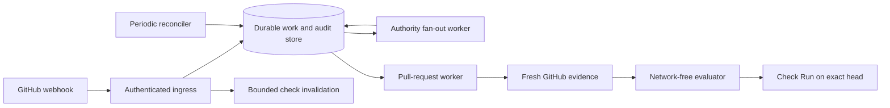
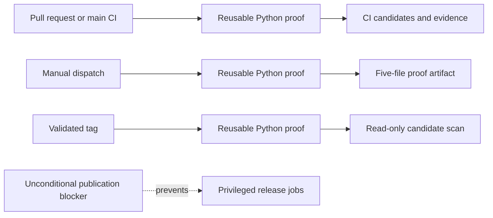

# Architecture

Extra CODEOWNERS has to react quickly when approval evidence changes, yet it
must not turn a partial view of GitHub into permission to merge. The service
handles those goals on separate paths: a bounded fast path tries to revoke an
old success immediately, while a durable worker performs the authoritative
evaluation.

This page describes the self-hosted GitHub App that exists today. The planned
Marketplace Action and hosted service are separate distributions.

## Design rules

The implementation follows four rules:

1. Store relevant work before acknowledging the webhook.
2. Fetch authorization evidence from GitHub; never trust a webhook payload as
   proof that a review or policy is valid.
3. Keep the policy evaluator deterministic and independent of the network and
   database adapters.
4. Let missing, stale, truncated, or contradictory evidence block success.

## From event to decision



In words, ingress authenticates and stores a trigger. A direct pull-request
trigger also gets a short opportunity to move the managed check back to
`in_progress`. Changes with wider authority impact—such as team membership,
policy, repository identity, or installation scope—enter a fan-out queue.

The pull-request worker fetches the current base, head, changed files, reviews,
team state, CODEOWNERS, and both policy scopes. The pure evaluator returns a
decision and explanation. The worker publishes only after proving that the
revisions, queue generation, and authority state are still current.

The scheduled reconciler supplies work for accessible open pull requests that
have gone idle. It is recovery for a missed event, not a source of stronger
consistency.

## Webhook ingress

`/webhooks/github` verifies the HMAC-SHA256 signature over the raw request body
before parsing any field that can affect authorization. For mapped events,
`X-GitHub-Delivery` is the deduplication key.

Ingress records the delivery and its pull-request or authority work in one
database transaction. Repeated triggers for one installation, repository, and
pull request coalesce behind a generation counter. A direct trigger also
advances the generation shared by every pull request on that repository and
head commit. An older worker cannot delete new work or replace another pull
request's invalidation with stale evidence.

Direct pull-request, review, and check-rerequest events use a bounded fast path.
After the durable transaction commits, ingress fetches the current pull request
and policy and tries to create or update the App's Check Run as `in_progress`.
If policy has disappeared but the App still owns a check of that name on the
head, the fast path invalidates that check too. A repository with neither
policy nor an existing managed check is not enrolled and produces no check.

The fast path is best effort. Its timeout is bounded by
`EXTRA_CODEOWNERS_WEBHOOK_INVALIDATION_TIMEOUT_SECONDS` and remains below
GitHub's delivery deadline. Once work is safely stored, an API error or timeout
is logged and counted, but ingress still returns `202`. The worker remains the
authority and makes the check blocking before evaluation.

Authority events need stricter ordering. Before an installation-wide authority
epoch can advance, ingress acquires a database-backed publication guard. If it
cannot obtain the guard within the same configured timeout, it returns `503`
without accepting the event. The operator must redeliver that event after the
database or lock recovers. GitHub
[does not automatically redeliver failed webhooks](https://docs.github.com/en/webhooks/using-webhooks/handling-failed-webhook-deliveries).

An authentic event does not always imply work. Unmapped actions are
acknowledged without retention, and the App's own check updates do not feed
back into its queue. If the process has no evaluator, it stores a mapped direct
delivery but returns `503`; it cannot claim the work will converge without a
worker.

## Durable authority ordering

Some changes can affect many pull requests at once. Authority work coalesces at
three scopes:

1. installation
2. repository
3. base ref.

Workers claim the broadest scope first. An installation job splits itself into
durable per-repository fences before it finishes, so one repository's retry
does not delay every other repository. A repository-wide fence supersedes
older base-ref rows.

The base-ref queue is bounded. A repository may retain 100 distinct base-ref
rows; the next one collapses them into one conservative repository job. A
contributor can make reevaluation broader, but cannot grow that queue without
limit or make the work disappear.

Repository routes are mutable names, so each job also records the
installation's authority epoch at enqueue time. A repository rename, transfer,
or installation-owner change advances the epoch before rediscovery. Work under
the previous epoch remains stale permanently, even after the fan-out job has
finished.

Late webhooks can still carry an old repository name. Before reading policy or
writing a check, the worker compares the queued route with the base repository
identity GitHub currently reports for the pull request. An installation-and-head
publication guard provides the last ordering layer across repository names.
None of these controls can revoke a success after a transfer or installation
change has already removed the App's access.

The organization-policy repository receives special treatment. If it leaves
the installation—or if removal evidence is malformed—the service schedules
installation-wide reevaluation for every target it can still reach. A
well-formed removal of an ordinary target repository is acknowledged without
pretending the App can update a repository it can no longer access.

## Pull-request worker

For each job, the worker first fetches the current revisions and moves the
named check on that head to `in_progress`. It then confirms that it owns the
newest database generation before collecting mutable reviews, labels,
membership, and policy.

The worker obtains a short-lived installation token and asks the GitHub adapter
for authoritative evidence. It passes an immutable snapshot to the evaluator,
then applies several publication fences:

- the base and head still match
- the pull-request generation is still current
- the shared generation for the head commit is still current
- the enqueue-time authority epoch is still current
- no relevant authority fan-out remains pending or retrying
- the publication guard permits this write.

The worker checks the shared generation while it holds the same head-level
guard used for Check Run writes. A completed write can have an uncertain
outcome when the client raises or is cancelled: GitHub may have applied the
result before the response was lost. The worker also checks the generation
again after a completed write returns. An uncertain write, changed generation,
database error, or task cancellation triggers a shielded reset to
`in_progress` before the guard is released. The original error remains
retryable.

That reset is still a GitHub API request. A hard process stop can interrupt it,
and GitHub can reject or time it out. In either case, a completed result may
remain visible until fast invalidation or durable retry reaches GitHub.

Pull-request and authority failures stay pending. They retry indefinitely with
exponential backoff capped by
`EXTRA_CODEOWNERS_WORKER_RETRY_MAX_SECONDS`. A provider rate limit instead uses
GitHub's separately bounded `Retry-After` value and does not advance ordinary
backoff. Abandoning a transient failure could strand an earlier success, so
there is no terminal “give up” state for authorization work.

## Reconciler

Webhooks are a change signal, not a complete recovery system. The endpoint may
be unavailable, GitHub may not redeliver, and access loss can make an old check
unreachable. The reconciler covers the recoverable middle ground.

At each interval, one elected reconciler scans accessible open pull requests.
When a pull request has no evaluation job and GitHub supplies a canonical head,
one transaction advances that head's shared generation and inserts the work.
If a row already exists, the scan changes neither the row nor the generation.
This fences an in-flight evaluation when reconciliation recovers genuinely
missing head work without resetting active or backoff-delayed jobs. An idle
pull request is reconsidered each interval, which temporarily moves its check
to `in_progress`.

The same singleton lease controls pruning of delivery IDs and unreferenced
shared-head generations older than the configured retention period. A queued
or leased job keeps its exact head generation. Long scans renew the lease
between installations. The organization-policy repository is never included
in reconciliation.

A shorter interval narrows some missed-event windows but spends more GitHub API
budget and causes more temporary blocking. It does not make the system strongly
consistent. Merge queues add a separate `merge_group` state that this version
does not evaluate.

## Pure evaluator

The evaluator imports no GitHub or database behavior. It accepts typed evidence
and then:

1. parses the standard CODEOWNERS file
2. compiles organization enrollment and repository delegation policy
3. reduces each actor's reviews to the latest opinionated review
4. groups changed paths by effective owner set
5. tests each group against eligible human and delegated App evidence.

That network-free boundary makes property tests and adversarial fixtures
practical. It also gives future distributions one semantic core to reuse.

The Python modules are not a stable public API before 1.0. A future Action or
hosted service should call an intentionally versioned interface rather than
turning incidental internal imports into another compatibility contract.

## What a `202` means

A successful webhook response means that the trigger is durably queued. It is
not a merge decision.

```text
GitHub             ingress             durable store        worker
  | signed event      |                       |                 |
  |------------------>| verify and store      |                 |
  |                    |---------------------->| new generation  |
  |<------------------| 202 after durable work|                 |
  |                    |                       |---------------> |
  |<------------------------------------------------------------| fetch current evidence
  |------------------------------------------------------------>| evidence
  |                    |                       |     evaluate and recheck fences
  |<------------------------------------------------------------| complete exact-head check
  |                    |                       |<--------------- | verify generation again
```

The quick invalidation can happen before or after the `202` depending on the
trigger and API timing. The completed result comes only from the worker after
fresh evidence and the final fences.

## Durable store and deployment

SQLite keeps local development simple. Production startup requires PostgreSQL
because all instances must share delivery deduplication, queue leases, retry
state, authority and shared-head generations, publication guards, and audit
records.

PostgreSQL operations use fixed fail-fast budgets: three seconds to connect,
two seconds to obtain a pooled connection, and three seconds for an ordinary
statement. Advisory-lock operations replace the statement timeout with the
bounded guard wait for that operation. Database migrations are explicit and
versioned; normal startup never mutates the schema.

The latest audit record retains the triggering delivery ID and reason for
correlation. Audit data may reveal private repository names, paths, owners, and
decision details, and rows do not expire automatically. Treat the database as
private repository metadata, set an operator-owned retention policy, and
include it in access reviews. Installation tokens and App private keys never
belong there.

The deployed topology is conventional:

```text
public HTTPS load balancer
  -> one or more stateless Extra CODEOWNERS processes
       -> shared PostgreSQL
       -> api.github.com

secret manager
  -> App private key, webhook secret, temporary setup-state secret
```

Bound request size and rate before traffic reaches the service. Metrics and
health endpoints are operator surfaces; keep them on a controlled network or
behind authenticated monitoring.

## The remaining consistency boundary

GitHub stores a Check Run on a commit, while Extra CODEOWNERS evaluates one
pull request. Before success, the worker confirms that no other open pull
request currently uses the same head. A pull request opened or retargeted later
can still inherit the completed result until its event is accepted and the
check is invalidated.

Generation fences, authority epochs, the fast path, and reconciliation all
make that window smaller. They cannot turn a commit-scoped GitHub object into a
pull-request-scoped one. This mismatch is why the current project must not
replace native code-owner enforcement in production.

## Distribution boundaries

The repository contains the App, evaluator, migrations, and Helm chart source.
CI builds multi-platform candidates but does not publish a supported image or
chart.

CI, manual proof runs, and the tagged read-only scan call one reusable Python
proof workflow. Each caller builds its own proof inside its own run; no caller
trusts artifacts from a different workflow run.



The current container evidence binds CPython's top-level identity to exact
runtime files and retains its pinned recipe, source archive, and source-carried
license. It also replays historical Python installs from each layer's `RECORD`.
Greenlet now has closed-world coverage on both architectures: exact wheel and
sdist identity, complete native-file ownership, embedded-component identity,
Alpine GCC source, and reviewed notices. MarkupSafe and SQLAlchemy also bind
their exact wheels and sdists to complete native-payload sets. Both have
explicit empty SBOM and component sets. Four other native-wheel owners still
need complete records for the surfaces they expose.

The tagged workflow contains intended image, chart, Python, SBOM, provenance,
signature, and GitHub-release jobs. An unconditional blocker keeps every
privileged job unreachable. Four issues describe the remaining release
boundary:

- [#18](https://github.com/stampbot/extra-codeowners/issues/18): source and
  notice completeness
- [#28](https://github.com/stampbot/extra-codeowners/issues/28): privilege
  separation between untrusted parsing and publication
- [#32](https://github.com/stampbot/extra-codeowners/issues/32): retained
  application build-proof handoff
- [#25](https://github.com/stampbot/extra-codeowners/issues/25): first
  immutable release publication.

Workflow definitions are not evidence that an artifact exists. No supported
release has been published.

The planned `extra-codeowners-action` should run a prebuilt, signed container
and reuse the same evaluator and policy schema. A hosted service would add new
requirements—tenant isolation, abuse handling, privacy, billing, support, and
service objectives—but must not introduce a second authorization engine with
almost the same rules.
