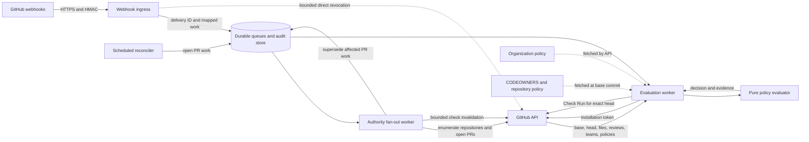

# Architecture

Extra CODEOWNERS has two jobs that pull in opposite directions. It must react
quickly when approval evidence changes, but it must never turn a partial view of
GitHub into permission to merge. The implemented GitHub App resolves that
tension with a fast invalidation path in front of a durable, deliberately
slower evaluation path.

This page explains that design. The self-hosted App and evaluator exist today.
A hosted service and Marketplace Action do not; they remain separate roadmap
items.

## Design goals

Four properties govern the design:

1. The service stores relevant webhook work before it acknowledges delivery. A
   bounded fast path tries to revoke a managed success immediately.
2. The evaluator uses evidence fetched from GitHub now. It never treats fields
   in a webhook payload as proof of authorization.
3. Policy evaluation is deterministic and does not depend on a network adapter.
4. Missing, stale, truncated, or contradictory evidence cannot produce success.

## Components

The data path begins with a signed GitHub event and ends with a Check Run on one
exact head commit:



In prose, the same flow works like this:

- Webhook ingress verifies GitHub's signature and deduplicates events that map to
  work. In one transaction, it records either direct pull-request work or an
  authority fan-out job. For a direct trigger, ingress also makes a bounded
  attempt to mark the managed check on the current head `in_progress`. It does
  not run the full evaluation while GitHub waits for a response.
- Authority fan-out responds to changes in a base branch, policy, label
  definition, membership, team, organization, installation, repository
  selection, or repository lifecycle. It finds affected open pull requests,
  supersedes their evaluation jobs, and makes a bounded attempt to invalidate
  their checks.
- A scheduled reconciler finds open pull requests with no queued work. It does
  not supersede active or retrying jobs. This is how the service eventually
  revisits an idle check after a missed webhook.
- An evaluation worker gets a short-lived installation token, marks the check
  on the current head `in_progress`, and fetches current pull-request evidence
  and policy.
- A network-free evaluator turns that evidence into a decision and an
  explanation.
- Before it publishes, the worker proves that the base, head, and database
  generation have not changed. It writes the completed check to the exact head,
  then checks the generation once more in case publication raced with new work.

### Webhook ingress

The public `/webhooks/github` endpoint first verifies the HMAC-SHA256 signature
over the raw request body. Only then does it parse fields that might affect
authorization. For events that map to work, `X-GitHub-Delivery` is the
deduplication key.

Ingress accepts the delivery and creates or updates its pull-request or
authority job in one database transaction. If the event changes authority for
an entire installation, the same transaction advances a persistent authority
epoch. Before that can happen, ingress waits for the installation's
database-backed publication guard. The wait is bounded by
`EXTRA_CODEOWNERS_WEBHOOK_INVALIDATION_TIMEOUT_SECONDS` and stays below
GitHub's delivery deadline. If ingress can't acquire the guard, it returns
`503` without recording the event. An operator must redeliver that event after
the database or lock recovers.

Not every authentic event needs durable work. Ingress acknowledges unmapped
events and actions without retaining them. In particular, the App's own check
updates don't become a feedback loop in the queue.

For a mapped pull-request, review, or check-rerequest event, ingress fetches the
current pull request and policy. When policy exists, it creates or updates the
managed check as `in_progress`. When policy has disappeared but this App still
manages a check with that name on the current head, it also puts that check back
`in_progress`. A repository with neither policy nor a managed check is not
enrolled, so ingress skips it. Broader authority events return after durable
acceptance and leave GitHub API work to the fan-out worker.

The direct-trigger fast path uses the same configured timeout. Once the event
is safely stored, a timeout or GitHub API error is logged and counted, but
ingress still returns `202`. The queued worker remains the authority and marks
the check `in_progress` before it evaluates. This split keeps the response
inside GitHub's 10-second deadline. That matters because GitHub
[does not automatically redeliver failed webhooks](https://docs.github.com/en/webhooks/using-webhooks/handling-failed-webhook-deliveries).

If no evaluator is configured, ingress stores the delivery and returns `503`:
it cannot claim that a worker will process the job. A manual duplicate
redelivery can resume a direct trigger whose invalidation is still pending. An
authority-guard timeout is different. It happens before acceptance, so the
original event must be redelivered after recovery.

Repeated triggers for the same installation, repository, and pull request
coalesce. A generation counter stops an older worker from deleting work that
arrived while it was evaluating.

### Durable store

SQLite keeps local development light. A production process refuses to start
without PostgreSQL, because every instance must share delivery deduplication,
leased pull-request and authority jobs, retry state, and audit records.
PostgreSQL connection, pool-checkout, and ordinary-statement budgets fail fast
after 3, 2, and 3 seconds respectively. Advisory-lock statements instead use
the bounded wait of the operation that needs the guard. Each pull-request job
keeps its newest triggering delivery ID, and the latest audit record keeps that
ID and its trigger reason for correlation.

Authority work coalesces at three scopes: installation, repository, and base
ref. Workers claim the broadest scope first. Before an installation-wide job
finishes, it durably splits itself into repository fences. A retry in one
repository therefore cannot hold back fan-out to every other repository.
Creating a repository-wide fence removes older base-ref rows for that
repository.

That base-ref queue has a hard bound. A repository can retain 100 distinct
base-ref rows; the 101st collapses them into one conservative repository-wide
fence. A contributor can make the worker do broader API work, but cannot grow
the queue without limit or make reevaluation disappear.

Repository jobs still need the mutable route `owner/repository`, so the store
also records an immutable ordering fact: the installation authority epoch at
enqueue time. An accepted repository-identity or installation-owner event
advances that epoch before the service rediscovers current repositories. Work
queued under an old name is then permanently stale, even if a worker claims it
only after fan-out. Fresh work gets the new name and epoch.

An old-name webhook can arrive late, after the epoch has advanced. The worker
therefore compares the queued route with the authoritative full name of the
pull request's base repository. It discards a mismatch before looking up policy
or writing a Check Run. As a last ordering layer, the installation-and-head
publication guard serializes check writes across repository names. None of
these controls can repair a transfer or installation change that removes the
App's access before it can update an existing check.

The elected reconciler prunes delivery IDs after the configured retention
period. An explicit versioned migration, not application startup, reactivates
terminal rows left by the older pre-release retry contract.

Audit evidence is sensitive. It can name private repositories, paths, owners,
and decision details, and the service does not automatically expire audit rows.
Treat the database as private repository metadata. Give retention an explicit
operator-owned policy and include the store in access reviews. Installation
tokens and GitHub App private keys never belong there.

### Worker

The worker handles authority jobs and pull-request jobs. For installation-wide
authority work, it lists every accessible repository and gives each target an
independently retryable repository job. That job lists affected open pull
requests and creates or supersedes all their jobs before it attempts bounded,
parallel check invalidation. An ordinary repository push is narrower: it
selects only pull requests whose base ref matches the pushed branch.

Losing the organization-policy repository is not an ordinary removal. If that
repository leaves the installation, or if the removal evidence is malformed,
the worker conservatively creates installation-wide work for every target it
can still reach. When a well-formed removal names only ordinary target
repositories, the service acknowledges it without work. Access is already
gone, so pretending it can update those repositories would be worse than doing
nothing.

For a pull-request job, the worker fetches the current revisions first. It
moves the named check on the current head to `in_progress` before it collects
mutable reviews and labels. The worker then confirms that its database
generation is current, fetches authoritative evidence, evaluates it, and posts
a completed Check Run for that generation only.

Evaluation and authority errors leave the job pending. They retry forever with
exponential backoff capped by
`EXTRA_CODEOWNERS_WORKER_RETRY_MAX_SECONDS`. GitHub rate limits use the
provider's separately bounded `Retry-After` value and do not advance ordinary
backoff. Giving up permanently would be unsafe: one transient dependency
failure could strand a stale success.

Several fences stop old work from winning a race. The worker checks the
pull-request generation before and after completion, then compares base and
head one last time. It refuses publication if the installation authority epoch
stored with the job is no longer current. That epoch remains a permanent fence
after the installation-wide job itself has finished.

Unresolved authority work is another fence. An evaluation that began before a
relevant authority change cannot publish while fan-out is pending or retrying.
The database-backed installation guard also orders final Check Run publication
against authority-webhook acceptance. Evaluations can normally publish in
parallel, but each result lands wholly before or after the authority event's
durable epoch change or fan-out. If a direct trigger commits during
publication, the worker immediately restores `in_progress`; the newer
generation evaluates next.

One boundary remains outside those fences. GitHub stores a Check Run on the
head commit, while Extra CODEOWNERS evaluates one pull request. Before success,
the worker confirms that no other open pull request currently shares that
head. A pull request opened or retargeted later can still inherit the completed
result until the new event is accepted and invalidated. Reconciliation can
recover a missed event, but it cannot turn a commit-scoped GitHub object into a
permanent pull-request-scoped one.

### Reconciler

Webhooks are a signal, not a complete recovery system. The endpoint can be
down, GitHub does not automatically redeliver a failed event, and the App
cannot repair some installation-wide losses after its access disappears. The
reconciler covers the recoverable middle ground.

At each interval, it discovers accessible open pull requests and creates work
only for a pull request with no evaluation job. While holding a
database-coordinated singleton lease, it also prunes expired webhook delivery
IDs. A long scan renews that lease between installations. The configured
organization-policy repository is never part of reconciliation.

The reconciler leaves active and backoff-delayed jobs alone. Otherwise, a slow
scan could repeatedly reset retry state or starve work that takes longer than
one interval. Pending failures keep their own schedule. An idle open pull
request is reevaluated at every interval, which temporarily moves its check to
`in_progress`.

Choosing the interval means balancing stale evidence, merge availability, and
GitHub API budget. Reconciliation bounds some missed-event delays; it does not
make the service strongly consistent. Merge queues add another state entirely.
Before Extra CODEOWNERS can support them with high assurance, it must evaluate
`merge_group` events and state.

### Pure evaluator

The core evaluator knows nothing about GitHub clients or databases. It accepts
typed evidence, parses CODEOWNERS, compiles organization and repository policy,
and reduces each actor to their latest opinionated review. Then it groups
changed paths by owner set and tests each group against human or delegated App
evidence. Keeping that boundary network-free makes adversarial and
property-based tests practical.

The evaluator is shared implementation, but it is not a stable public Python
API before 1.0. A future distribution should call an intentionally versioned
interface with these tested semantics. Importing arbitrary internal modules
would quietly create a second compatibility promise.

## Evaluation sequence

A `202` webhook response means “the work is safe in the queue,” not “this pull
request may merge.” The final decision comes later:

```mermaid
sequenceDiagram
    participant G as GitHub
    participant I as Ingress
    participant D as Durable store
    participant W as Worker
    participant E as Evaluator

    G->>I: Signed pull-request or review event
    I->>I: Verify raw-body signature
    I->>D: Record delivery and enqueue generation
    I->>G: Fetch current PR and managed check
    alt Policy exists or managed check exists and fast path succeeds
        I->>G: Create or update current-head check as in progress
        I->>D: Mark fast-path invalidation complete
    else No policy and no managed check
        Note over I,G: Deliberately skip unenrolled repository
        I->>D: Mark fast-path invalidation complete
    else Fast path times out or GitHub is unavailable
        Note over I,D: Log deferral; durable job remains authoritative
    end
    I-->>G: Accepted
    W->>D: Lease latest PR generation
    W->>G: Fetch current base and head
    W->>G: Set current-head check in progress
    W->>D: Confirm generation is current
    W->>G: Fetch installation-scoped current evidence
    G-->>W: Base, head, files, reviews, teams, policy
    W->>E: Typed immutable snapshot
    E-->>W: Decision and evidence
    W->>G: Re-fetch base and head
    W->>D: Confirm generation is current and authority work is resolved
    alt Base or head changed
        W->>D: Request a newer generation
    else Generation was already superseded
        Note over W,G: Keep check in progress for newer work
    else Relevant authority work is pending
        Note over W,G: Keep check in progress until fan-out recovers
    else Snapshot is current
        W->>G: Complete Check Run on head
        W->>D: Confirm generation after publication
        alt Superseded during publication
            W->>G: Restore check to in progress
        else Generation is still current
            W->>D: Complete job and record audit
        end
    end
```

In prose, ingress authenticates and stores the trigger. It then makes a bounded
attempt to create or update a blocking managed check. A repository with neither
policy nor an earlier managed check is skipped. If that fast path times out or
GitHub's API fails, ingress still acknowledges the durable work; a manual
redelivery can retry the marker.

The worker fetches the current revision independently and keeps the check
blocking. Before it collects evidence, it proves that it owns the newest
database generation. The pure evaluator decides. Before completion, the worker
checks the revisions and generation again and makes sure no relevant authority
job remains unresolved. It checks the generation once more after publication.
A revision race creates fresh work. A trigger or authority race leaves the
check `in_progress`, or puts it back there, for the newer job.

## Deployment topology

The self-hosted topology is intentionally ordinary: one or more stateless
web-and-worker processes share PostgreSQL.

```text
public HTTPS load balancer
  -> Extra CODEOWNERS instances
       -> PostgreSQL durable state
       -> api.github.com
secret manager
  -> App private key, webhook secret, setup-state secret
```

The public load balancer should bound request size and rate before traffic
reaches the application. Put `/metrics` and the health endpoints on an
operator-controlled network or an authenticated monitoring path. They are
operational surfaces, not public product APIs.

## Distribution boundaries

The repository currently implements the GitHub App service and reusable Python
evaluator. It also contains a dedicated Helm chart. After successful `main` CI,
the project publishes signed, attested containers for `main` and the exact
commit. These development builds are available for evaluation, but they are not
supported releases.

Exact semantic-version tags are wired to publish a signed versioned image, OCI
chart, Python artifacts, provenance, and software-bill-of-material
attestations. Workflow code is not proof that those artifacts exist; only a
successful tagged release creates them. No supported release has been
published.

Tested chart-upgrade guarantees and a reproducible Google Cloud deployment
guide are still planned. The Marketplace Action will live separately as
`extra-codeowners-action` and run a prebuilt signed container instead of
building Python dependencies in every workflow. A paid hosted installation may
follow later, but it would first need tenant isolation, billing, support
boundaries, and explicit service-level objectives.

However they are packaged, future distributions must reuse the evaluator and
policy schema. Two authorization implementations with almost the same rules
would eventually disagree at exactly the wrong moment.
