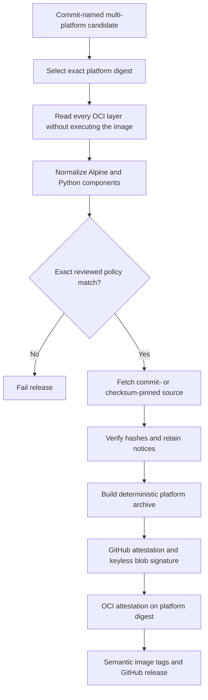

# Container distribution evidence design

Extra CODEOWNERS distributes more than its Apache-2.0 application code. Its OCI
image also carries CPython, locked Python packages, Alpine packages, and files
that a later layer hides. The release evidence makes that aggregate reviewable;
it does not declare the aggregate legally compliant.

## Evidence flow

The release job works on the already-pushed, commit-named candidate. It selects
the exact amd64 and arm64 platform manifests and runs the same collector for
each. The collector requires that selected digest to appear in Docker's local
repository-digest record after the pull; a caller cannot bind evidence to an
unrelated digest. Pull-request CI has a separate, explicit local-only mode that
uses the image configuration digest because its candidates have not been
published.

In text: image inventory precedes source retrieval; policy drift or missing
source stops the job; signing and publication happen only after the archive is
complete. The candidate's commit-only tag may exist after a failed job, but no
semantic image tag or GitHub release is created by that run.

## Why all layers are in scope

An OCI whiteout changes the effective filesystem. It does not erase bytes from
an already distributed lower layer. For example, the final runtime removes
system `pip`, but its metadata and implementation remain retrievable from the
base layer. The collector therefore records every regular file occurrence and
its SHA-256, applies whiteouts only to determine effective state, and retains
source for both effective and lower-layer Python components.

The effective inventory and all-layer inventory answer different questions:

- the effective inventory supports runtime, vulnerability, and operational
  analysis
- the all-layer inventory supports redistribution review and incident forensics.

Neither replaces the per-platform SPDX software bill of materials (SBOM). The
SBOM is signed separately and remains the standard machine-readable package
inventory.

## Source selection

The collector uses four source paths:

1. Alpine's installed database identifies each binary package's origin and
   exact 40-character aports commit. The collector downloads only that
   commit's recipe subtree, verifies its reviewed archive hash, parses one
   literal `sha512sums` block as data, and fetches non-local filenames from the
   versioned Alpine distfiles mirror. It never executes an `APKBUILD`.
2. `uv.lock` supplies immutable URLs, sizes, and SHA-256 values for installed
   Python sdists. A separately reviewed policy entry covers a wheel-only
   component such as `psycopg-binary` and lower-layer `pip`.
3. The Docker Official Python recipe is pinned by repository commit and file
   hash. It names the exact CPython archive and SHA-256, which the policy also
   records. The committed Dockerfile must use the policy's exact Python image
   index digest for both the builder and runtime stages, and the runtime stage
   must be final.
4. `git archive HEAD` preserves the application source from the same revision
   recorded in the candidate image label.

Every network URL must use credential-free HTTPS. Downloads and archive members
have size and count limits. Archive paths, recipe links, duplicate names, hash
mismatches, unsupported checksum forms, and missing source-carried license
files fail closed. Retrieved project build scripts are data; the collector does
not import or execute them.

## Reviewed policy and deterministic output

`.compliance/container-policy.json` has three distinct roles:

- exact component baselines for `linux/amd64` and `linux/arm64`
- reviewed license resolutions and hash-pinned standard texts
- exact exceptional sources, recipe archives, and the human distribution
  approval state.

Observed metadata is never overwritten. `THIRD_PARTY_NOTICES.md` shows both the
observed and reviewed expressions, so a normalization or override remains
visible. A package, version, architecture, license expression, metadata hash,
effective-state, origin, or aports-commit change breaks the byte-for-byte policy
comparison.

The archive fixes member order, owner, group, mode, gzip timestamp, and tar
timestamp. It includes `SHA256SUMS`, a canonical JSON manifest, the raw
inventories, the reviewed policy, source, and license material. The outer
manifest and small OCI predicate both name the exact platform digest. Identical
inputs produce identical archive bytes; signatures and attestations are
separate artifacts because their transparency-log timestamps vary.

## Release controls

Three independent controls protect publication:

- a GitHub tag ruleset restricts `v*` tag changes to an explicit maintainer
  bypass identity
- the release workflow requires the configured open milestone to have zero open
  issues before any publish job can run; it fetches the committed milestone
  number directly and verifies the expected title
- the source collector requires a committed maintainer approval before it emits
  a release archive.

The tag-triggered workflow cannot undo a tag that an authorized user already
pushed. Its guarantee is narrower: an unready tag does not publish versioned
images, charts, Python artifacts, or a GitHub release through this workflow.

## Trust boundary and residual risk

The evidence proves what the collector observed and fetched under its policy.
It does not prove that upstream metadata is correct, that every copyright
holder was identified, or that a chosen delivery mechanism satisfies every
jurisdiction. Hashes protect reviewed bytes from silent mutation; they do not
make the original source trustworthy.

A maintainer must inspect both platform archives and approve recipient delivery.
Qualified legal review is required before a paid hosted distribution. Keep
those decisions separate from scanner results, SBOM generation, OpenSSF badges,
and collector success.

Recipients can follow the
[container evidence verification guide](../how-to/verify-container-evidence.md).
Maintainers use the
[container evidence review procedure](../how-to/review-container-evidence.md).
