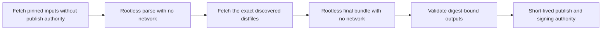

# Container distribution evidence design

Extra CODEOWNERS distributes more than its Apache-2.0 application code. Its OCI
image also contains CPython, locked Python packages, Alpine packages, and bytes
hidden by later layers. Container evidence makes that aggregate inspectable. It
does not declare the aggregate legally compliant.

## Current status

Pull-request CI builds separate `linux/amd64` and `linux/arm64` candidates and
uploads an evidence archive for each platform. These short-lived, unsigned
artifacts are review inputs. Their subject is the local image configuration
digest because CI has not published a platform manifest.

Tagged publication is deliberately disabled. The release workflow exits after
its milestone check and before every job that can publish an image, chart,
Python package, or GitHub release. Setting
`distribution_approval.approved=true` does not remove that structural block.
Security issue
[`#28`](https://github.com/stampbot/extra-codeowners/issues/28) tracks the
required privilege-separated release implementation.

## What the CI collector proves

The collector saves the inspected image by immutable configuration ID. It
checks the SHA-256 name of the saved configuration and every layer against the
actual member bytes before parsing them. It then:

1. applies OCI whiteout and opaque-directory behavior without letting archive
   order remove files created in the same layer
2. inventories the effective Alpine database and Python package metadata, plus
   every regular file occurrence in every layer
3. rejects duplicate or conflicting authoritative metadata and an APK
   architecture that does not match the requested platform
4. requires the final image's initial layer diff IDs to match the reviewed
   platform-specific Docker Official Python base
5. compares the normalized component inventory byte-for-byte with the reviewed
   platform policy
6. retrieves hash-pinned source and license material and produces a
   deterministic archive.

CI uploads the artifact even after a collection failure when any partial files
exist. That upload is diagnostic only: the required collection step still
fails the job, and an absent artifact does not become success.

## Why all layers are in scope

An OCI whiteout changes the effective filesystem. It does not erase bytes from
an already distributed lower layer. For example, the final runtime removes
system `pip`, but its metadata and implementation remain retrievable from the
base layer. The collector therefore retains source for effective and hidden
Python components and records every regular-file occurrence with its digest.

The two inventories answer different questions:

- the effective component inventory supports runtime, vulnerability, and
  operational analysis
- the all-layer file inventory supports redistribution review and incident
  forensics.

Neither replaces a per-platform SPDX software bill of materials (SBOM).

## Source selection

The collector obtains source without executing an `APKBUILD`, `setup.py`, or
downloaded build script:

1. Alpine's installed database supplies each package origin and exact
   40-character aports commit. The policy pins the recipe-subtree archive hash.
   By default, one literal `source` block must correspond exactly, in order, to
   one literal `sha512sums` block. Local regular files are verified directly;
   other filenames are downloaded from the pinned Alpine distfiles release and
   verified with SHA-512.
2. Four reviewed Alpine recipes use source construction or a safe link that
   cannot be represented by the default parser. Each exception is bound to the
   exact origin and commit, requires a rationale, and grants only dynamic-source
   handling or an exact link path, type, and target. A link can never replace
   `APKBUILD` or a checksummed source.
3. `uv.lock` supplies immutable URLs, sizes, and SHA-256 values for installed
   Python source distributions. Reviewed policy entries cover wheel-only and
   lower-layer components not represented by a locked source distribution.
4. The Docker Official Python recipe is pinned by commit and file hash. Its one
   literal `PYTHON_VERSION` and `PYTHON_SHA256` declaration must select the same
   CPython URL and hash recorded by policy. The Dockerfile must use the exact
   reviewed base index for its builder and final runtime stages.
5. `git archive HEAD` retains the application source at the revision recorded
   in the image label.

Every fetched URL and redirect must be credential-free HTTPS. Redirects are
bounded, and `MANIFEST.json` records the complete ordered URL chain as `urls`
while retaining the requested URL as `url`. Downloads, layers, and archive
members have cumulative and per-item limits. Duplicate JSON keys, non-finite
numbers, path controls, traversal, unsafe or unexpected links, digest
mismatches, and ambiguous source metadata fail closed.

## License evidence

Observed package metadata is never overwritten. `THIRD_PARTY_NOTICES.md` shows
both observed and reviewed expressions. A component, version, architecture,
license expression, metadata hash, effective state, origin, or aports commit
change breaks the policy comparison.

A `LicenseRef-*` resolution requires an exact component set, a nonempty
rationale, and one source-carried notice path and SHA-256 for every covered
component. An unrelated file with a plausible name cannot satisfy the pin. The
current public-domain resolutions bind these exact records:

- `alpine:tzdata@2026b-r0` to
  `licenses/from-source/alpine-tzdata/061340856888-LICENSE`, SHA-256
  `0613408568889f5739e5ae252b722a2659c02002839ad970a63dc5e9174b27cf`
- `alpine:xz-libs@5.8.3-r0` to
  `licenses/from-source/alpine-xz/616a3ad264ce-COPYING`, SHA-256
  `616a3ad264ce29b8f1cb97e53037b139d406899ca8d1f799651e17bfa09830b8`.

The deterministic archive normalizes member order, ownership, mode, and
timestamps. It includes checksums, canonical manifests, raw inventories, the
reviewed policy, source, notices, and license material.

## Required release architecture

The current collector parses hostile images and archives while it can also use
the network. A release job with package-write, OpenID Connect, signing, or
attestation authority must not run that combined operation. Issue `#28`
requires four bounded phases:

The parsing phases must run rootless with `--network none`, immutable inputs,
read-only mounts where practical, and explicit size limits. The first parse
emits a bounded request for checksum-addressed distfiles. A separate fetch step
retrieves only that request. The final offline parse must reproduce and validate
the complete archive before a privileged job signs or publishes anything.

The future recipient contract also requires a platform digest, archive digest,
signed predicate, and OCI attestation to agree. Identical attestations produced
by a rerun may be deduplicated; two distinct valid predicates for one platform
must fail verification.

## Trust boundary and residual risk

The evidence proves what the collector observed and fetched under reviewed
policy. It does not prove upstream metadata is correct, identify every
copyright holder, or decide whether a delivery mechanism satisfies every
jurisdiction. Hashes protect reviewed bytes from silent mutation; they do not
make the original source trustworthy.

A maintainer must review both platforms and separately approve recipient
delivery. Qualified legal review remains necessary before a paid hosted
distribution. Keep those decisions separate from scanner results, SBOMs,
OpenSSF badges, and collector success.

Maintainers use the
[CI evidence review procedure](../how-to/review-container-evidence.md). The
[recipient verification procedure](../how-to/verify-container-evidence.md)
documents the contract a future supported release must satisfy.
