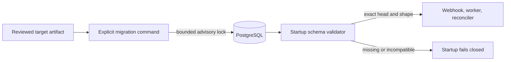

# Why database migrations are explicit

Extra CODEOWNERS is merge-control infrastructure. Its database stores pending
revocations, webhook deduplication, authority generations, leases, and audit
evidence. Starting against the wrong schema must block the service rather than
silently create a plausible but incomplete database.

The project uses Alembic because it is the maintained migration layer for
SQLAlchemy and can run from the same uv-built Python package. Revision files
contain explicit operations. Runtime ORM metadata is used to validate the
result, not as an upgrade plan.

## Separation of responsibilities

The migrator is the only component allowed to change schema. It serializes
replicas with a PostgreSQL session advisory lock. Session locks survive
transaction boundaries but are released by PostgreSQL if the connection or
process dies. Polling uses `pg_try_advisory_lock`, so lock wait has an explicit
deadline instead of consuming the ordinary SQL statement budget.

The service checks both the Alembic head and the expected ORM shape. Missing
tables, columns, primary keys, named unique constraints, or indexes stop
startup. Readiness repeats a lightweight revision and query compatibility
check. Neither path calls `create_all` or applies a revision.

## Transaction and restore contract

PostgreSQL runs each revision transactionally. A failed revision rolls back
before the migration lock is released. SQLite remains available for local
development, but SQLite DDL is not the production interruption-recovery
contract.

Every application artifact accepts one exact Alembic head. A migration that
changes that head crosses a restore boundary even when its SQL only adds a
nullable column or an index. The previous artifact rejects the newer revision
by design, so rolling its image back also requires restoring the verified
backup taken at its revision.

Alembic downgrades are intentionally not an operator interface. Data
transformations such as reactivating abandoned work cannot be reconstructed
reliably, and a downgrade would make the revision marker claim an unverified
state. Operators preserve the failed database, restore into a new empty
database, and validate that restored copy with the previous artifact under
native GitHub code-owner protection.

The Helm hook runs before the old application Deployment is replaced. A
migration must still avoid unbounded rewrites and destructive operations that
could break an old process during the hook. That execution constraint does not
make the old artifact compatible with the new head or remove the restore
requirement.

## Why startup does not auto-migrate

Automatic startup migration couples availability, privilege, and schema
ownership to every webhook replica. During a rollout it can race different
application versions, hide an incomplete deployment behind repeated pod
restarts, and make a read-only runtime role impossible.

Explicit migration gives operators a bounded change step and evidence before
traffic moves. It also permits separate database roles now: the Helm Job has
migration-only Secret, environment, volume, mount, and ServiceAccount inputs.
It does not inherit the runtime GitHub App Secret or credential mounts. The
runtime database role can therefore omit schema-change privileges, while the
migration role can be limited to database migration authority.

## Release discipline

Every schema-changing pull request must include:

- an immutable Alembic revision with one predecessor and one head
- a fresh-install test and an upgrade test from the preceding revision
- PostgreSQL interruption, concurrency, and shape validation where applicable
- an entry in the [versioned upgrade notes](../reference/upgrade-notes.md)
- an explicit head-change and restore boundary
- chart, container, and documentation updates when operator behavior changes.

CI checks that the application's declared head matches the packaged Alembic
head. Exact release deployment and restore evidence still belongs in the
release record; source tests cannot prove an operator's backup is recoverable.
