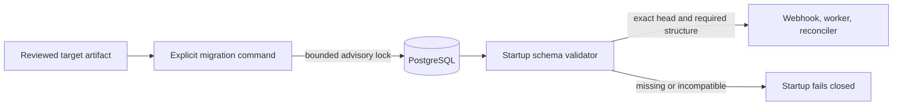

# Why database migrations are explicit

Extra CODEOWNERS decides whether a pull request may merge, and its database is
part of that decision. The database records pending revocations, accepted
webhooks, authority and shared-head generations, leases, and audit evidence. A
database with the wrong schema can still answer a health query while omitting
state that the authorization path needs.

For that reason, the service refuses to start against an incompatible schema.
It does not try to repair one on the way up.

Alembic is the project's migration layer. It is maintained for SQLAlchemy and
ships in the same uv-built Python package as the service. Each revision states
the intended database operations. SQLAlchemy metadata verifies the result; it
is not an upgrade plan.

## One component changes the schema

The migration command and the running service have different jobs:

Only the migrator changes the schema. On PostgreSQL, concurrent migrators
serialize on a session advisory lock. A session lock survives transaction
boundaries, which lets Alembic commit revisions without releasing it.
PostgreSQL still releases the lock if the owning connection or process dies.

The wait loop calls `pg_try_advisory_lock`. Waiting for another migrator
therefore has its own deadline instead of consuming the 60-second SQL statement
budget.

At startup, the service verifies all of the following:

- the one expected Alembic head
- the application compatibility marker
- required tables and columns
- compatible column definitions and PostgreSQL timestamp time-zone modes
- primary keys, named unique constraints, and indexes
- expected generated values.

Readiness performs a lighter check of the revision and a representative query.
Neither startup nor readiness calls `create_all` or applies a migration.

## A new head creates a restore boundary

PostgreSQL runs each Alembic revision in a transaction. If a revision fails,
its changes roll back before the migration lock is released. SQLite is useful
for local development, but its data-definition behavior is not the production
interruption-recovery contract.

Every application artifact accepts exactly one Alembic head. That makes every
head change a restore boundary, even when the SQL only adds a nullable column
or an index. The previous artifact rejects the new revision. Rolling back the
image therefore also means restoring the backup taken while the database was
still at the previous revision.

Alembic downgrades are deliberately not an operator interface here. Some
changes, including reactivating abandoned work, cannot be reconstructed from
the resulting database. A downgrade would move the revision marker to a state
the project has not verified.

The recovery path is a backup restore instead: preserve the failed database,
restore the backup into a new empty database, and run the previous artifact's
validation against that copy. Native GitHub code-owner protection stays enabled
throughout recovery. The [upgrade procedure](../how-to/upgrade.md) describes
the operator sequence.

The Helm migration hook runs before Helm replaces the old application
Deployment. Schema changes must therefore avoid unbounded rewrites and
destructive operations that could break the old process while the hook runs.
That brief overlap does not make the old artifact compatible with the new
head, nor does it remove the backup-and-restore requirement.

## Why startup never migrates

If startup migrated automatically, every webhook replica would need
schema-changing credentials. Replicas from different application versions
could race during a rollout, and repeated pod restarts could make a migration
that never completed harder to see.

An explicit command gives operators one bounded change to observe before
traffic moves. It also permits separate database roles. The Helm Job has its
own Secret, environment, volume, mount, and ServiceAccount inputs; it does not
inherit the runtime GitHub App Secret or credential mounts. A deployment may
omit schema-changing privileges from the runtime role and reserve the
privileges needed by reviewed revisions for the migration role.

## What a schema-changing release must establish

Every pull request that changes the schema must include:

- an immutable Alembic revision with one predecessor and one head
- a fresh-install test and an upgrade test from the preceding revision
- PostgreSQL interruption, concurrency, and structure validation where they
  apply
- an entry in the [database upgrade notes](../reference/upgrade-notes.md)
- an explicit statement that the head changed and rollback requires a database
  restore
- matching chart, container, and documentation changes when operator behavior
  changes.

CI verifies that the application-declared head matches the head packaged with
Alembic. A release still needs deployment and restore evidence: source tests
cannot prove that an operator's backup is recoverable.
