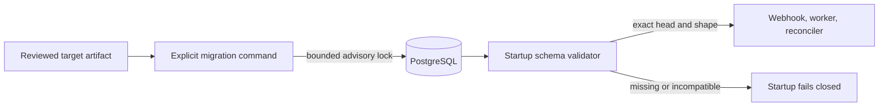

# Why database migrations are explicit

Extra CODEOWNERS is merge-control infrastructure. Its database stores pending
revocations, webhook deduplication, authority generations, leases, and audit
evidence. Starting against the wrong schema must block the service rather than
silently create a plausible but incomplete database.

The project uses Alembic because it is the maintained migration layer for
SQLAlchemy and can run from the same uv-built Python package. Revision files
contain explicit operations. Runtime ORM metadata is used to validate the
result, not as an upgrade plan.

## Separation of responsibilities

The migrator is the only component allowed to change schema. It serializes
replicas with a PostgreSQL session advisory lock. Session locks survive
transaction boundaries but are released by PostgreSQL if the connection or
process dies. Polling uses `pg_try_advisory_lock`, so lock wait has an explicit
deadline instead of consuming the ordinary SQL statement budget.

The service checks both the Alembic head and the expected ORM shape. Missing
tables, columns, primary keys, named unique constraints, or indexes stop
startup. Readiness repeats a lightweight revision and query compatibility
check. Neither path calls `create_all` or applies a revision.

## Transaction and compatibility contract

PostgreSQL runs each revision transactionally. A failed revision rolls back
before the migration lock is released. SQLite remains available for local
development, but SQLite DDL is not the production interruption-recovery
contract.

The Helm hook runs before the old application Deployment is replaced. Every
ordinary release migration must therefore be an additive expansion that the
immediately previous application can tolerate. Destructive contraction belongs
in a later release after the rollback window, and its release note must state
that restoring an earlier application requires restoring its verified backup.

Application rollback and database rollback are different operations. Alembic
downgrades are intentionally not an operator interface: data transformations
such as reactivating abandoned work cannot be reconstructed reliably. An image
rollback is allowed only when versioned notes declare the earlier application
compatible with the current schema. Otherwise operators restore a verified
native PostgreSQL backup under native GitHub code-owner protection.

## Why startup does not auto-migrate

Automatic startup migration couples availability, privilege, and schema
ownership to every webhook replica. During a rollout it can race different
application versions, hide an incomplete deployment behind repeated pod
restarts, and make a read-only runtime role impossible.

Explicit migration gives operators a bounded change step and evidence before
traffic moves. It also permits a tighter steady-state database role in a future
split-role deployment. The current initial chart uses the same database
environment sources for both processes. Installations whose database
authentication depends on Kubernetes identity may select a pre-existing
migration service account through chart values.

## Release discipline

Every schema-changing pull request must include:

- an immutable Alembic revision with one predecessor and one head
- a fresh-install test and an upgrade test from the preceding revision
- PostgreSQL interruption, concurrency, and shape validation where applicable
- an entry in the [versioned upgrade notes](../reference/upgrade-notes.md)
- explicit previous/target application compatibility and backup boundaries
- chart, container, and documentation updates when operator behavior changes.

CI checks that the application's declared head matches the packaged Alembic
head. Exact release deployment and restore evidence still belongs in the
release record; source tests cannot prove an operator's backup is recoverable.
