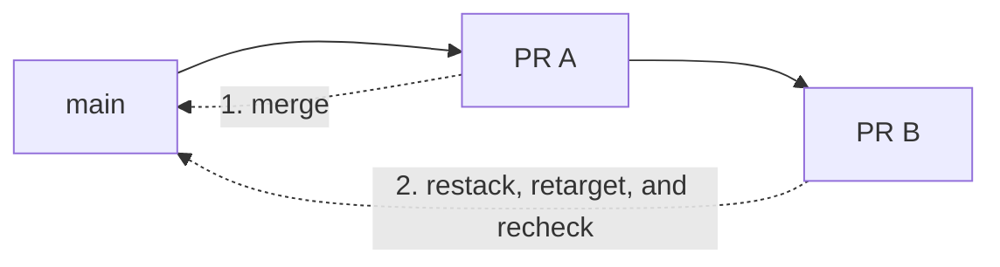

# Review and merge stacked pull requests

A stacked pull request targets another pull-request branch instead of `main`.
That makes early review possible, but its green checks describe the current
feature base. After the lower change merges, the child needs a new head and a
fresh `main` comparison before it can merge safely.

This repository permits squash and rebase merges. In either case, moving the
base alone is not enough: the child still contains the parent branch history
that reviewers saw. Use the procedure below to remove that history, replay only
the child delta, and force GitHub to check a new head SHA.

## Before you begin

Confirm all of these conditions:

- Bash, Git, and an authenticated GitHub CLI are available.
- The checkout is clean and `origin` points to this repository.
- Each pull request targets the branch immediately below it; the bottom one
  targets `main`.
- The branches live in this repository and you may push them with a lease.
- Every commit carries a valid DCO sign-off.
- You may retarget, rewrite, and merge the pull requests.

Record every pull-request number and exact head SHA before merging anything.
The child's rebase needs the parent head SHA that reviewers saw, not the commit
or commits that the merge later places on `main`.



In words: merge PR A, replay only PR B's commits onto the new `main`, publish a
new child head, wait for the complete check set, then merge PR B.

## 1. Treat stacked checks as early feedback

Wait for these workflows on every level of the stack:

- DCO
- CodeQL
- Dependency review
- workflow security, including actionlint, full action pins, and zizmor.

They run for opened, reopened, synchronized, and edited pull requests even when
the base is another feature branch. DCO and dependency review both calculate
their range from the pull-request event's current base and head.

A green result on a feature base is not approval to merge the same head into
`main`. Retargeting changes the comparison and GitHub's synthetic merge commit,
but it may leave the head SHA unchanged. GitHub also does not emit a child
`synchronize` event merely because its parent branch moved.

If a child becomes conflicted, update its head before continuing.
`pull_request` workflows do not run for a merge snapshot GitHub cannot create.

## 2. Capture the parent boundary

Set the two pull-request numbers, then record their branches and the exact
parent head:

```bash
PARENT_HEAD="$(gh pr view "$PARENT_PR" --json headRefOid --jq .headRefOid)"
CHILD_BRANCH="$(gh pr view "$CHILD_PR" --json headRefName --jq .headRefName)"
PARENT_BRANCH="$(gh pr view "$PARENT_PR" --json headRefName --jq .headRefName)"
printf 'parent=%s parent-head=%s child=%s\n' \
  "$PARENT_BRANCH" "$PARENT_HEAD" "$CHILD_BRANCH"
```

Put that output in the review notes. Stop if a value is empty or does not match
the pull-request page.

## 3. Merge only the bottom pull request

Merge the lowest pull request after all of its required `main` checks pass.
Never merge a child into its feature base as a shortcut.

Wait for the merged change to appear on `main`. If more pull requests remain,
the next one is now the bottom of the stack.

## 4. Replay the child onto the new `main`

Fetch the new base and child branch. Work from a detached checkout so an
existing local branch cannot be overwritten, and create a backup before the
rewrite:

```bash
git fetch origin main "$CHILD_BRANCH"
ORIGINAL_BRANCH="$(git branch --show-current)"
test -n "$ORIGINAL_BRANCH"
git switch --detach "origin/$CHILD_BRANCH"
OLD_CHILD_HEAD="$(git rev-parse HEAD)"
BACKUP_BRANCH="backup/restack-$CHILD_PR-$(date -u +%Y%m%dT%H%M%SZ)"
git branch "$BACKUP_BRANCH"
git rebase --force-rebase --onto origin/main "$PARENT_HEAD"
NEW_CHILD_HEAD="$(git rev-parse HEAD)"
test "$NEW_CHILD_HEAD" != "$OLD_CHILD_HEAD"
git diff --check origin/main...HEAD
```

The rebase selects commits after the recorded parent head, drops the parent
history already represented on `main`, and replays only the child delta.
`--force-rebase` ensures GitHub receives a different head identity even when a
commit would otherwise be unchanged.

If Git reports a conflict, continue only when the intended child delta is
clear. Otherwise run `git rebase --abort` and stop. Review
`git diff origin/main...HEAD` against the pull request's prior intended change
before touching GitHub.

## 5. Retarget and publish the rewritten head

Retarget the pull request, then immediately push the rewrite with an exact
lease:

```bash
CURRENT_BASE="$(gh pr view "$CHILD_PR" --json baseRefName --jq .baseRefName)"
if [[ "$CURRENT_BASE" != main ]]; then
  gh pr edit "$CHILD_PR" --base main
fi
git push \
  --force-with-lease="refs/heads/$CHILD_BRANCH:$OLD_CHILD_HEAD" \
  origin "HEAD:refs/heads/$CHILD_BRANCH"
```

GitHub sometimes retargets a child automatically when it deletes the merged
parent branch. Otherwise, `gh pr edit` emits an `edited` event. The push emits
`synchronize` for the new head. Do not merge between those operations.

If the push fails after retargeting, close the pull request while you
investigate:

```bash
gh pr close "$CHILD_PR"
```

Never replace the lease with `--force`. A lease failure means the remote branch
changed after your fetch. Repeat the restack from that new remote head, push the
corrected rewrite, and only then reopen the pull request.

!!! warning
    GitHub stores checks on a commit. Immediately after retargeting, the page
    can display a success produced for the previous base. Do not merge until
    the child has a different head SHA and all required `main` checks finish on
    that exact SHA.

## 6. Verify the exact head, then merge

Confirm the remote head and watch its checks:

```bash
test "$(gh pr view "$CHILD_PR" --json headRefOid --jq .headRefOid)" = \
  "$NEW_CHILD_HEAD"
gh pr checks "$CHILD_PR" --watch
```

Review **Files changed** again. Confirm each run belongs to the retargeted pull
request and rewritten head. Both the GitHub Actions `Analyze Python` job and
the GitHub Advanced Security `CodeQL` result must pass; the analysis job alone
does not prove that code scanning accepted its findings.

Merge the child. Delete the local backup only after the merge and its resulting
`main` checks succeed:

```bash
git switch "$ORIGINAL_BRANCH"
git branch --delete --force "$BACKUP_BRANCH"
```

Repeat from the bottom upward until the stack is empty.

## Why the workflow boundary matters

The security workflows use `pull_request`, not `pull_request_target`. They
receive no repository secrets, OIDC token, write permission, or privileged
cache. CodeQL gets `actions: read` where needed; source access is read-only.

Checked-in steps do not execute application code from the pull request. DCO
reads commit metadata, while pinned actions inspect source, dependencies, and
workflow data. A pull request can still change the workflow being reviewed, so
the token boundary remains necessary. A separate trusted CodeQL job receives
`security-events: write` only for `main` pushes, schedules, and explicit
dispatches.

Feature branches created before the current triggers reached `main` may still
contain older workflow definitions. Rebase them before relying on automatic
stack checks. A first-time fork workflow can also wait for explicit maintainer
approval.

If a retarget run never appears, do not merge. Confirm the base change in the
timeline. Close and reopen only after checking that repository automation does
not treat closure as cancellation. Repeated missing runs are a
repository-automation incident.
