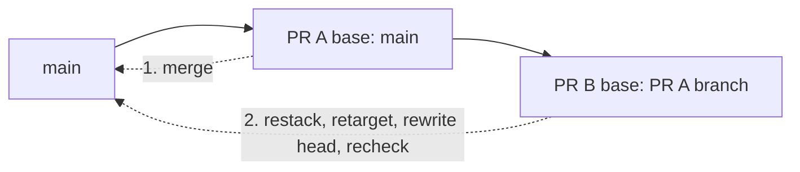

# Review and merge stacked pull requests

Use this procedure when one pull request targets the branch of another pull
request instead of `main`. Security checks run against each pull request's
current base so a stacked change receives useful feedback before the lower
change merges.

## Prerequisites

Before reviewing the stack, confirm that:

- Bash, Git, and an authenticated GitHub CLI are available;
- the working tree is clean and `origin` names this repository;
- each pull request targets the branch immediately below it;
- the lowest pull request targets `main`;
- the stack uses same-repository branches that you can force-with-lease;
- every commit has a valid Developer Certificate of Origin sign-off; and
- you can retarget, rewrite, and merge the pull requests.

Record the pull request numbers and the exact head SHA of each branch before
merging anything. This repository squash-merges, so you need the parent head
SHA to remove the already-reviewed parent commits from its child.

The following diagram shows a two-pull-request stack. The numbered labels are
the safe merge order.



In text: merge PR A first. Restack PR B onto the new `main`, retarget it, push
the rewritten head, wait for checks on that exact head, and only then merge PR
B.

## 1. Review checks on the stacked base

Wait for these workflows to complete on every pull request in the stack:

- DCO
- CodeQL
- Dependency review
- Workflow security, including actionlint, immutable action pins, and zizmor

These workflows respond to opened, reopened, synchronized, and edited pull
requests regardless of base branch. DCO calculates
`base.sha..head.sha` from the pull-request event. Dependency review uses the
same event's current dependency delta.

Treat these results as early feedback. A success against a feature base is not
authorization to merge the same head into `main`, because retargeting changes
the base comparison and synthetic merge snapshot. It does not necessarily
change the head commit.

GitHub does not emit a child pull request's `synchronize` event when only its
base branch moves. After every parent-branch push, rewrite or update the child
head and wait for new checks. A merge-conflicted pull request does not run
`pull_request` workflows; resolve the conflict by updating its head before
continuing.

## 2. Record the parent and child state

Set `PARENT_PR` and `CHILD_PR` to the two pull request numbers. Run these
commands from a clean repository checkout whose `origin` remote is this
repository:

```bash
PARENT_HEAD="$(gh pr view "$PARENT_PR" --json headRefOid --jq .headRefOid)"
CHILD_BRANCH="$(gh pr view "$CHILD_PR" --json headRefName --jq .headRefName)"
PARENT_BRANCH="$(gh pr view "$PARENT_PR" --json headRefName --jq .headRefName)"
printf 'parent=%s parent-head=%s child=%s\n' \
  "$PARENT_BRANCH" "$PARENT_HEAD" "$CHILD_BRANCH"
```

Record that output in your review notes. Stop if any value is empty or names a
different branch than the pull-request page.

## 3. Merge the bottom pull request

Merge only the lowest pull request after its required `main` checks pass. Do
not merge a higher pull request into its feature base as a substitute for
retargeting it.

If more than one pull request remains, the next pull request is now the bottom
of the stack.

Wait for the squash commit to reach `main` before continuing.

## 4. Restack the child locally

Fetch the new `main` and the child branch, then create a local backup before
rewriting anything:

```bash
git fetch origin main "$CHILD_BRANCH"
ORIGINAL_BRANCH="$(git branch --show-current)"
test -n "$ORIGINAL_BRANCH"
git switch --detach "origin/$CHILD_BRANCH"
OLD_CHILD_HEAD="$(git rev-parse HEAD)"
BACKUP_BRANCH="backup/restack-$CHILD_PR-$(date -u +%Y%m%dT%H%M%SZ)"
git branch "$BACKUP_BRANCH"
git rebase --force-rebase --onto origin/main "$PARENT_HEAD"
NEW_CHILD_HEAD="$(git rev-parse HEAD)"
test "$NEW_CHILD_HEAD" != "$OLD_CHILD_HEAD"
git diff --check origin/main...HEAD
```

The detached checkout avoids overwriting any existing local child branch. The
forced rebase selects only commits after the recorded parent head, drops the
squash-merged prerequisite commits, and replays the child commits onto the new
`main`. The final `test` guarantees a new head identity.

If rebase reports a conflict, resolve and continue it only when the intended
child delta is clear. Otherwise run `git rebase --abort` and stop. Review
`git diff origin/main...HEAD` and compare it with the child pull request's
previous intended delta before changing GitHub state.

## 5. Retarget, then publish the rewritten head

Retarget the child first, then immediately push the already-reviewed rewrite:

```bash
CURRENT_BASE="$(gh pr view "$CHILD_PR" --json baseRefName --jq .baseRefName)"
if [[ "$CURRENT_BASE" != main ]]; then
  gh pr edit "$CHILD_PR" --base main
fi
git push \
  --force-with-lease="refs/heads/$CHILD_BRANCH:$OLD_CHILD_HEAD" \
  origin "HEAD:refs/heads/$CHILD_BRANCH"
```

GitHub can retarget the child automatically when it deletes the merged parent
branch. Otherwise, the explicit base change emits an `edited` pull-request
event. The four security workflows include that event, so each evaluates the
new base and old head. The following force-with-lease push emits `synchronize`
for the rewritten head. Do not merge between these commands.

If the push fails, immediately close the pull request while you investigate:

```bash
gh pr close "$CHILD_PR"
```

Do not replace `--force-with-lease` with `--force`. A lease failure means the
remote child changed after your fetch and your local rewrite is stale. Repeat
the restack against the new remote head. Push the corrected head before
reopening the pull request; reopening triggers the security workflows.

> [!WARNING]
> GitHub stores Check Runs on the head commit. Immediately after retargeting,
> the pull request can display a success created for its previous base. Do not
> merge until the child has a different head SHA and the complete required
> `main` check set finishes on that exact SHA.

## 6. Verify the exact head and merge

Confirm GitHub received the rewritten head:

```bash
test "$(gh pr view "$CHILD_PR" --json headRefOid --jq .headRefOid)" = \
  "$NEW_CHILD_HEAD"
gh pr checks "$CHILD_PR" --watch
```

Review the Files changed view again. Confirm that the new workflow runs use
the retargeted pull request and exact rewritten head. Both `Analyze Python`
from GitHub Actions and `CodeQL` from GitHub Advanced Security must succeed;
the analysis job completing does not by itself prove the code-scanning result
accepted its findings.

Then merge the pull request. Delete the backup branch only after the merge is
complete and its resulting `main` checks pass:

```bash
git switch "$ORIGINAL_BRANCH"
git branch --delete --force "$BACKUP_BRANCH"
```

Repeat the retarget, recheck, and review sequence from the bottom upward until
the stack is empty.

## Security boundary

The security workflows use the `pull_request` event, not
`pull_request_target`. They receive no repository secrets, OpenID Connect
token, write permission, or privileged cache. Their pull-request token
permissions are `actions: read` where CodeQL needs it and `contents: read`.

The checked-in workflow steps do not execute application code from the pull
request. DCO reads commit metadata, while the other workflows use pinned
actions to analyze source, dependency, or workflow data. A pull request can
still propose workflow changes, so the read-only token boundary remains
necessary and the workflow-security checks are not a substitute for reviewing
those changes. The CodeQL job receives no write scope on pull requests; GitHub
permits code-scanning uploads for runs triggered by `pull_request`. A separate
trusted job receives
`security-events: write` only for `main` pushes, schedules, and explicit
dispatches.

Feature bases created before these workflow triggers reached `main` can carry
the older filtered definitions. Rebase them onto current `main` before relying
on automatic stacked checks. First-time fork workflows can also wait for a
maintainer's explicit Actions approval.

If a retarget run does not appear, do not merge. Confirm the base change in the
pull-request timeline, then close and reopen the pull request only after
checking that repository automation will not treat closure as cancellation.
Reopening triggers the same security workflows. Report repeated missing runs
as a repository-automation incident.
