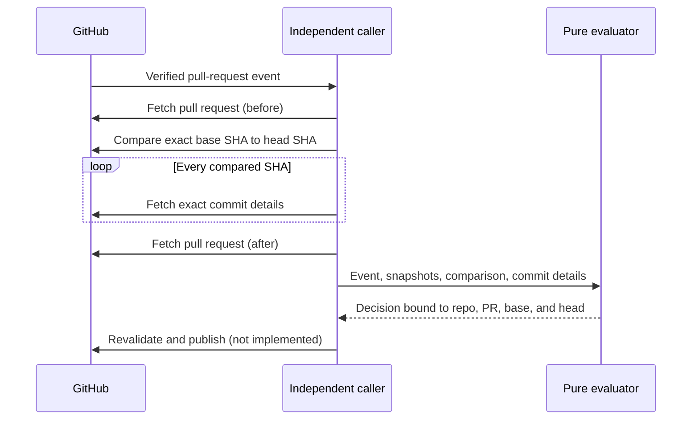

# DCO evidence contract

Extra CODEOWNERS contains a pure Developer Certificate of Origin (DCO)
evaluator. It is not the DCO check that runs on pull requests today. No service
or workflow calls it, and it cannot publish a Check Run.

The checked-in `.github/workflows/dco.yml` workflow remains active. Because a
pull request can change that workflow, treat its result as review evidence—not
as an independently enforced merge control. [Issue #40][issue-40] tracks the
independent caller, publication guard, live tests, and rollout.

This page defines the evidence that caller must collect. Incomplete,
contradictory, stale, or ambiguous evidence must leave the check blocking.

## Collection sequence

The caller must use a verified GitHub event and current GitHub API responses.
It must not check out or execute code from the pull request.



In order, the caller must:

1. Parse the event snapshot from the pull request and top-level repository in
   the verified webhook payload.
2. Fetch the current pull request and parse the `before` snapshot.
3. Compare the exact `before.base_sha` and `before.head_sha`, with 100 commits
   per page.
4. Fetch each compared commit by its full SHA and parse the fields the
   evaluator consumes.
5. Fetch the pull request again and parse the `after` snapshot.
6. Evaluate only when the event, `before`, and `after` snapshots match exactly.
7. Before publishing success, fetch the pull request once more and require the
   same repository, pull-request number, open state, base SHA, head SHA, and
   commit count. This publication guard does not exist yet.

Snapshot equality includes repository IDs and names, pull-request number and
state, base and head refs, base and head SHAs, author identity, and commit
count. A force-push, retarget, repository change, or concurrent commit makes
the evidence stale.

A network, permission, rate-limit, parsing, or validation error does not
produce a decision. The future caller must keep the required check blocking
and retry from a fresh snapshot.

## Exact comparison

The client uses GitHub's [compare two commits endpoint][compare-commits], which
GitHub documents as equivalent to `git log BASE..HEAD`. Both selectors are the
full SHAs from the validated `before` snapshot.

For a same-repository head, the request is:

```text
GET /repos/BASE_OWNER/REPOSITORY/compare/BASE_SHA...HEAD_SHA
```

For a fork in the same repository network, GitHub documents an owner-qualified
form:

```text
GET /repos/BASE_OWNER/REPOSITORY/compare/BASE_OWNER:BASE_SHA...HEAD_OWNER:HEAD_SHA
```

The client takes both owners from the exact base and head repository identities
in the snapshot. It rejects distinct repositories with the same owner because
that URL cannot identify which repository supplied each side. A missing fork,
lost access, repository outside the network, or other API ambiguity fails; the
client does not fall back to a mutable endpoint.

GitHub returns comparison commits in chronological order. The client requests
exactly the number of pages implied by the snapshot count and validates every
page:

- `base_commit.sha` is the exact base SHA
- `total_commits` and `ahead_by` are strict integers equal to the snapshot
  count
- those three metadata values remain identical across pages
- `commits` is an array with the exact expected page length
- every item is an object with a unique, lowercase 40-character SHA
- the accumulated list contains the exact snapshot count
- the final SHA is the exact head SHA.

One page may contain at most 100 commits. The complete comparison may contain
at most 250. Counts above 250 are rejected before they can become authorization
evidence.

This exact range closes a retarget ABA gap in the pull-request commit-list
endpoint. If a pull request changes from base A to base B and back to A while
keeping the same head and commit count, `A...HEAD` still identifies the intended
range. Evidence collected for `B...HEAD` carries base B and cannot be reused for
the A snapshot.

## Commit details and graph checks

Each full commit comes from GitHub's [get a commit endpoint][get-commit], using
the exact SHA from the comparison. The request asks for one file entry because
GitHub repeats commit metadata on each changed-file page; file diffs are not
DCO evidence.

The evaluator then requires:

- one detail response for every compared SHA, in the same order
- every parent that is also in the comparison to appear before its child
- every compared commit to be reachable from the exact head through compared
  parents.

Merge commits are valid. Stacked pull requests are also valid: a parent outside
the current comparison does not need to appear.

GitHub documents chronological comparison order, not a topological-order
guarantee. Requiring parents before children is therefore an additional
fail-closed policy. Before rollout, the live contract fixture must cover merge
graphs and deliberately skewed commit timestamps. It must also prove that the
base repository can fetch exact commit details for private-fork heads. Failure
of either contract blocks rollout.

## Ordinary sign-offs

An ordinary commit passes when one complete message line matches its raw Git
author:

```text
Signed-off-by: AUTHOR NAME <AUTHOR EMAIL>
```

The evaluator applies Python `str.casefold()` to both strings and then compares
them for equality. It does not normalize Unicode. This is deterministic across
runner locales and does not send author-controlled text to a shell.

Leading or trailing whitespace, a carriage return, extra text, or a matching
substring on a longer line does not pass. Git identities cannot contain the
`<` or `>` delimiters. Control and formatting characters are rejected before
matching.

The regression corpus records the intended Unicode behavior:

| Raw author | Trailer identity | Result |
| --- | --- | --- |
| `Test Contributor <contributor@example.com>` | `TEST CONTRIBUTOR <CONTRIBUTOR@EXAMPLE.COM>` | Pass |
| `Zoë <zoë@example.com>` | `ZOË <ZOË@EXAMPLE.COM>` | Pass |
| `ΟΣ <sigma@example.com>` | `ος <SIGMA@EXAMPLE.COM>` | Pass; final sigma case-folds to sigma |
| `İpek <ipek@example.com>` | `i̇PEK <IPEK@EXAMPLE.COM>` | Pass; the first `i` is followed by a combining dot |
| `Straße <straße@example.com>` | `STRASSE <STRASSE@EXAMPLE.COM>` | Pass; sharp S case-folds to `ss` |
| `José <jose@example.com>` | `José <JOSE@EXAMPLE.COM>` | Fail; decomposed and precomposed accents are not normalized |

The active workflow delegates case-insensitive matching to GNU `grep` and the
runner locale. Python case folding is a deliberate replacement, not an assumed
equivalent. Before cutover, run this corpus through both implementations in a
disposable repository. Any difference is a migration failure until it is
explained, reviewed, and resolved; unit tests alone do not establish live
parity.

Results contain only fixed outcomes and commit SHAs. They never copy raw commit
messages or identities into check output.

## Dependabot fallback

The ordinary rule is tried first. An official Dependabot commit may instead
use GitHub's canonical `dependabot[bot] <support@github.com>` trailer, but only
when every predicate below matches.

| Evidence | Required value |
| --- | --- |
| Pull-request author | Login `dependabot[bot]`, user ID `49699333`, type `Bot` |
| Repository | Base and head repository IDs equal the evaluated repository ID |
| Branch and history | Head ref starts with `dependabot/`; the pull request has one commit |
| Commit position | Commit SHA is the exact head; its only parent is the exact base |
| GitHub author | Login `dependabot[bot]`, user ID `49699333`, type `Bot` |
| GitHub committer | Login `web-flow`, user ID `19864447`, type `User` |
| Raw Git author | `dependabot[bot] <49699333+dependabot[bot]@users.noreply.github.com>` |
| Raw Git committer | `GitHub <noreply@github.com>` |
| Signature | Verified with reason `valid`; signature, payload, and verification time are nonempty |
| Trailer | Exact, case-sensitive line `Signed-off-by: dependabot[bot] <support@github.com>` |

The fallback stays case-sensitive and does not use Unicode case folding.
Dependabot can still pass the ordinary route when its trailer matches its raw
Git author.

## Input limits and parsing

Evidence models are immutable and reject unknown fields. Their parsers copy
only fields used by the decision.

| Field | Limit |
| --- | --- |
| Compared commits, detail responses, and results | 250 |
| One compare API page | 16 MiB after HTTP decoding |
| One individual commit response | 8 MiB after HTTP decoding |
| Parents per commit | 64 |
| Commit message | 1,000,000 UTF-8 bytes |
| Git author or committer name and email | 1,024 UTF-8 bytes per field |
| Base or head ref | 1,024 UTF-8 bytes |
| GitHub actor login and type | 256 and 64 UTF-8 bytes, respectively |
| Repository full name | 512 ASCII bytes |
| Verification reason and timestamp | 128 UTF-8 bytes per field |
| Verification signature or payload | 2,000,000 UTF-8 bytes per field |

The bounded JSON reader decodes bytes strictly as UTF-8 before parsing. It
rejects a UTF-8 byte-order mark, UTF-16, UTF-32, duplicate object keys,
excessive nesting, and integers beyond Python's parser limit.

Commit messages and signature material may contain newlines, but not NUL.
Repository names keep their exact case and must match
`[A-Za-z0-9_.-]+/[A-Za-z0-9_.-]+`; `.` and `..` are invalid components. Refs,
actor fields, and Git identities reject control and formatting characters.

## Result contract

Every result carries the evaluated repository identity, pull-request number,
base SHA, and head SHA. That binding is required even for a failure, so a future
publisher cannot mistake a decision for another snapshot.

Each commit has one fixed outcome:

- `author-signoff`
- `official-dependabot`
- `missing-signoff`.

A passing result has no failure reason. A failure uses one fixed value and does
not include untrusted evidence:

| Failure | Meaning |
| --- | --- |
| `pull-request-not-open` | The event snapshot was not open. |
| `pull-request-changed` | The event, `before`, and `after` snapshots differed. |
| `comparison-mismatch` | The comparison was bound to a different repository, PR, base, or head. |
| `commit-count-mismatch` | Comparison metadata, compared commits, details, or snapshot count differed. |
| `duplicate-commit` | The comparison repeated a SHA. |
| `head-mismatch` | The comparison did not end at the exact snapshot head. |
| `commit-order-mismatch` | Detail order, parent order, or reachability disagreed. |
| `missing-signoff` | At least one commit passed neither sign-off route. |

## Rollout boundary

`GitHubClient.compare_pull_commits` and `GitHubClient.get_commit` provide the
read-only API operations. No runtime path calls them for DCO today.

The independent integration still must:

- run code that the evaluated pull request cannot modify
- limit its installation token to **Pull requests: read**, **Contents: read**,
  and **Checks: write**
- perform the publication guard against the exact repository, PR, base, head,
  state, and count
- publish a distinct required context bound to the expected GitHub App source
- leave API, validation, race, and publication failures blocking
- pass same-repository, fork, merge, stacked, retarget, force-push, Unicode,
  and negative source-binding cases in a disposable repository.

Do not replace the current DCO check or change repository rules based on this
dormant layer. Follow [issue #40][issue-40] for the remaining implementation
and live evidence.

[compare-commits]: https://docs.github.com/en/rest/commits/commits?apiVersion=2026-03-10#compare-two-commits
[get-commit]: https://docs.github.com/en/rest/commits/commits?apiVersion=2026-03-10#get-a-commit
[issue-40]: https://github.com/stampbot/extra-codeowners/issues/40
