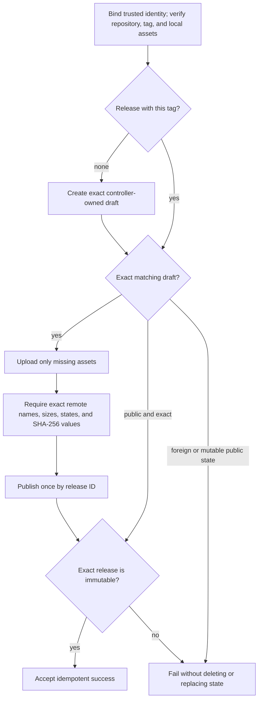

# Immutable release controller contract

Extra CODEOWNERS includes an offline-tested state machine for creating one
exact, immutable GitHub release. It is not connected to the release workflow
and cannot publish anything today. The concrete GitHub API adapter, final asset
policy, and workflow handoff remain work under issues
[#25](https://github.com/stampbot/extra-codeowners/issues/25),
[#18](https://github.com/stampbot/extra-codeowners/issues/18),
[#28](https://github.com/stampbot/extra-codeowners/issues/28), and
[#32](https://github.com/stampbot/extra-codeowners/issues/32).

The controller lives in `.github/scripts/release_controller.py`. Its narrow
`ReleaseAPI` protocol deliberately has no operation for deleting a release,
asset, or tag, and no operation for replacing an existing asset.

Loading a manifest validates its syntax and bounds; it does not make the
manifest trusted. Before any GitHub mutation, `reconcile_release()` requires a
separate `ExpectedIdentity` supplied from trusted workflow context and the
reviewed asset-plan digest. Repository ID and name, tag, target commit,
workflow path and commit, run ID, and manifest SHA-256 must all match. Deriving
that expected identity from the untrusted manifest would defeat the boundary.
The controller also reconstructs the canonical manifest from the supplied
`ReleasePlan` and verifies its digest before comparing trusted values. A caller
cannot change a frozen plan with `dataclasses.replace()` and keep the digest of
the manifest that was originally loaded.

## Release manifest

The controller accepts one single-link regular manifest no larger than 256 KiB.
Its canonical JSON encoding sorts object keys, uses compact separators, escapes
non-ASCII characters, and ends with one line feed. JSON objects may not repeat
keys. Floating-point and non-finite numbers are invalid. The top-level value is
depth 1; the maximum depth is 8, and the complete document may contain at most
4,096 JSON items.

The top-level object has exactly these fields:

| Field | Requirement |
| --- | --- |
| `schema_version` | Integer `1`. |
| `repository_id` | Positive GitHub repository ID, at most `2^63 - 1`. |
| `repository` | Exact `OWNER/REPOSITORY` name. |
| `tag` | Semantic tag in the form `vMAJOR.MINOR.PATCH`. |
| `target_commit` | Lowercase, full 40-character Git commit ID. |
| `workflow_path` | Workflow path under `.github/workflows/`. |
| `workflow_sha` | Lowercase, full 40-character commit ID for the workflow. |
| `run_id` | Positive GitHub Actions run ID, at most `2^63 - 1`. |
| `assets` | Complete, sorted asset array. |

The manifest digest binds all of that identity into the release body as
`<!-- extra-codeowners-release-controller:v1 manifest-sha256:DIGEST -->`. A
draft created for another repository, tag, commit, workflow, run, manifest, or
asset set is therefore foreign state, even if its name looks familiar.

Each asset has exactly `name`, `path`, `size`, and `sha256`. Names are safe
basenames of at most 255 characters. Paths are relative POSIX paths whose final
component equals `name`; absolute paths, empty segments, traversal, backslashes,
more than eight path segments, and unsupported characters are rejected. Names
and paths must be unique, and the array must be sorted by name.

The manifest may contain 1 through 64 assets. Each file must be nonempty and no
larger than 2 GiB. Their combined declared size may not exceed 16 GiB.

## Local file boundary

The controller opens the asset root and every path component with no-follow
semantics. Every asset must be a single-link regular file whose size and
SHA-256 match the manifest. It keeps the verified read-only file descriptors
open until reconciliation finishes; an API adapter must stream from those
descriptors and must not reopen a pathname.

Manifest and asset file opens are nonblocking. A FIFO or another special file
is rejected after inspection instead of waiting for a writer and hanging the
release job.

Reads use 1 MiB chunks. The controller retains at most 64 asset descriptors and
does not buffer an asset in memory. It rehashes an asset after upload and
rehashes the complete set immediately before publication. A deployment budget
must account for those repeated reads, the open-descriptor limit, API-client
memory, and the final asset-set size. The 16 GiB input limit is not a statement
that every runner can process that much data within a normal job timeout.

## Reconciliation states

The state machine first binds the manifest to `ExpectedIdentity`, requires the
live repository ID to match, and resolves the existing tag to the expected
commit. It then lists a bounded number of releases and follows one of these
paths:

An upload URL is accepted only when it uses HTTPS on `uploads.github.com`, has
the exact repository and release-ID path, and has no credentials, port, query,
or fragment. Remote assets must form the exact manifest name set. Every asset
must be in the uploaded state and have the expected nonzero size and GitHub
server `sha256:` digest. Unexpected, duplicate, missing, empty, or mismatched
assets stop reconciliation.

A previously published release is idempotent success only when its complete
controller identity and asset set match and GitHub reports `immutable: true`.
The release must also have `prerelease: false`. An otherwise matching mutable
or prerelease publication is an integrity incident, not a state the controller
repairs.

The immutable repository ID returned by the API is the live GitHub security
identity. The repository name is bounded routing and audit data that the future
adapter must supply from trusted workflow context; this offline core does not
query GitHub for a canonical name. After a rename, generate a new manifest and
expected identity for the same repository ID. The controller does not silently
adopt the old name.

After the last complete local rehash, the controller rereads the same release
by ID, requires it to remain an exact non-immutable draft, rereads the complete
remote asset set, and resolves the tag again before publication. It repeats
those checks after GitHub reports the release immutable. A protected `v*` tag
ruleset that denies updates and deletion is still a prerequisite.

GitHub's release API does not provide a compare-and-swap publication over all
of that state. Another actor with `contents: write` can race a final API read
and publication. Give release authority to one serialized workflow and do not
share its token with unrelated jobs. An administrator who bypasses those
controls could still move the tag or alter the draft in that narrow interval.
The post-publication checks detect the resulting incident, but the controller
cannot repair or delete an immutable release. See GitHub's [immutable release
contract](https://docs.github.com/en/code-security/concepts/supply-chain-security/immutable-releases).

## Ambiguous responses and recovery

Network failure can hide whether a GitHub mutation succeeded. The adapter must
report that case as `AmbiguousMutationError`; an ordinary validation or API
error must not be mislabeled as ambiguous.

| Lost response | Reconciliation rule |
| --- | --- |
| Draft creation | Relist releases and continue only with the one exact controller-owned draft. Fail if it is absent or ambiguous. |
| Asset upload | Relist assets and continue only if that exact asset now exists with the planned size and digest. Do not retry an upload whose outcome is unknown. |
| Publication | Read the same release by ID for a bounded three polls. Accept only the exact immutable release. |

A failed run can leave a private draft containing a partial or rejected asset
set. The controller never removes it automatically. Until the API adapter and
operator runbook land, a maintainer must treat such a draft as evidence to
inspect, not as something automation may age-clean. No current workflow calls
the controller, so this recovery procedure is not yet an operational release
path.

## Non-claims

The controller proves state-machine and byte-identity rules in offline tests.
It does not yet:

- call the GitHub API or upload an asset
- define the final release asset set
- prove that source, notice, SBOM, signature, or attestation evidence is
  complete
- enable the repository's immutable-release setting
- invoke `gh release verify`
- make tagged publication reachable.

The repository must keep publication blocked until the concrete adapter,
privilege-separated evidence path, final asset policy, operator recovery
procedure, and live immutable-release verification are complete.
