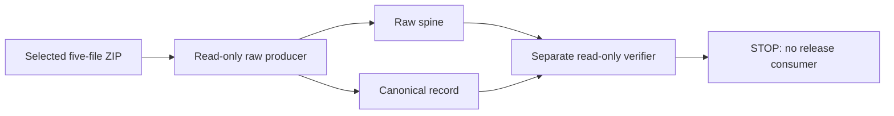

# Raw Python-distribution spine format

This page defines the raw transport produced by
`.github/workflows/python-distribution.yml`. It is for maintainers who change
the Python build proof, artifact handoff, or future release pipeline.

**Status: internal transport only.** The reusable workflow builds and verifies
the raw artifacts, but no downstream release-evidence or publication job
consumes them. Issue
[#32](https://github.com/stampbot/extra-codeowners/issues/32) tracks that
handoff. A passing workflow proves this transport contract; it does not make
the application publishable.

The workflow uploads two raw artifacts alongside the selected five-file ZIP:

| Artifact | Media type | Purpose |
| --- | --- | --- |
| `extra-codeowners-python-SOURCE_SHA-artifact-SELECTED_ID-attempt-PRODUCER_ATTEMPT.bin` | `application/vnd.stampbot.python-distribution-spine.v1+octet-stream` | Five selected files concatenated in one fixed order. |
| `extra-codeowners-python-SOURCE_SHA-artifact-SELECTED_ID-attempt-PRODUCER_ATTEMPT.spine.json` | `application/vnd.stampbot.python-distribution-spine.v1+json` | Canonical identity, file ranges, and digests. |

Both uploads use GitHub Actions' `archive: false` transport. A separate
read-only job downloads each file by immutable artifact ID with
`skip-decompress: true`, then checks its upload-action digest and content. The
selected ZIP remains the input to current container consumers.



The reusable workflow exports the producer attempt, reusable-workflow ref and
commit, artifact IDs, and artifact digests only after the verifier succeeds.
Future consumers must retain those values instead of substituting identity
from their own job.

## Trust inputs

Pass every value below to the verifier separately from the downloaded record:

| Value | Trusted source |
| --- | --- |
| Repository ID and name | GitHub workflow context. |
| Source revision and run ID | Calling workflow context. |
| Producer run attempt | Output written by the raw producer from its own `GITHUB_RUN_ATTEMPT`. |
| Reusable workflow ref and commit | Current job identity from `job.workflow_ref` and `job.workflow_sha`. |
| Selected artifact ID and provider SHA-256 | Pinned upload step in the selection job. |
| Wheel and selection-record SHA-256 | Validated selection-job outputs. |
| Raw spine and record provider SHA-256 values | Their pinned direct-upload steps. |

GitHub associates the `github` context of a reusable run with its caller. The
`job.workflow_ref` and `job.workflow_sha` values identify the reusable workflow
that defines the current job. The workflow uses those job values when they are
available. Direct runs fall back to the equivalent `github` values. See
GitHub's [contexts
reference](https://docs.github.com/en/actions/reference/workflows-and-actions/contexts#job-context).

The workflow ref's repository must equal the calling repository in the record.
This contract covers the repository's local reusable workflow, not a
cross-repository distribution service.

These values are trust anchors only when the workflow revision that supplies
them has already been accepted. The current PR check runs candidate workflow
code with read-only permissions. It is useful test evidence, not a privilege
boundary against a malicious workflow change. Tagged publication remains
blocked until a trusted release consumer can verify retained evidence without
running candidate-controlled code with publication authority.

## Canonical record

The record is ASCII JSON with sorted object keys, compact separators, escaped
non-ASCII characters, and one final line feed. Duplicate keys, floating-point
values, non-finite numbers, alternate encodings, and unknown fields are
invalid. The top-level value is depth 1. The maximum depth is 8, the maximum
JSON value count is 1,024, and the encoded record may not exceed 128 KiB.

The top-level object has exactly these fields:

| Field | Requirement |
| --- | --- |
| `schema_version` | Integer `1`, not a boolean. |
| `media_type` | `application/vnd.stampbot.python-distribution-spine.v1+json`. |
| `repository` | Exact `id` and `name` matching trusted workflow values. |
| `run` | Exact producer `id` and `attempt`. |
| `source` | Exact 40-character lowercase `revision`. |
| `workflow` | Exact `.github/workflows/` `path`, full `ref`, and 40-character lowercase `sha`. |
| `selected_artifact` | Immutable `id` and provider `sha256` of the selected five-file ZIP. |
| `selection` | Trusted `wheel_sha256` and `record_sha256`. |
| `spine` | Exact `filename`, media type, byte `size`, and `sha256`. |
| `files` | The five exact contiguous file-range records. |

Artifact and run IDs are canonical positive decimal strings no larger than
`2^63 - 1`. SHA-256 values are 64 lowercase hexadecimal characters. The
workflow ref must bind its repository and path to a safe branch, tag, or pull
request ref.

## File ranges

Each file record has exactly `filename`, `kind`, `offset`, `sha256`, and
`size`. Ranges start at offset zero, have no gaps, overlaps, aliases, or
trailing bytes, and cover the entire spine in this order:

1. `build-record-amd64` as `python-build-record-amd64.json`.
2. `build-record-arm64` as `python-build-record-arm64.json`.
3. `selection-record` as `python-selection-record.json`.
4. `sdist` as the selected `PROJECT-VERSION.tar.gz`.
5. `wheel` as the selected `PROJECT-VERSION-py3-none-any.whl`.

The wheel and source-distribution filenames must contain the same captured
project-and-version identity string. The verifier compares that string exactly;
it does not normalize it at this boundary. Every file digest must be distinct.
The wheel range digest must equal the trusted wheel digest, and the
selection-record range digest must equal the trusted selection-record digest.

| Bound | Value |
| --- | ---: |
| Canonical spine record | 128 KiB |
| Build record or selection record range | 4 MiB each |
| Wheel or source distribution | 64 MiB each |
| Complete spine | 140 MiB |
| Verification read chunk | 1 MiB |

## Selection projection

The consumer does not open the wheel or source-distribution archive. It parses
only the bounded, canonical selection record. That record must bind:

- source revision and selected `amd64` architecture.
- distinct amd64 and arm64 proof-record digests, filenames, and expected
  machine names.
- source-distribution and wheel filenames, sizes, and SHA-256 values.

Each projected value must match its verified spine range. This checks the
five-file relationship without adding a ZIP, tar, gzip, network, or process
parser to the consumer.

The producer has a different job. It downloads the selected ZIP by immutable
ID and invokes the existing selection verifier before packing the five files.
All archive parsing stays in that read-only producer.

## File handling and exposure

The selected directory must be a real directory. Builder inputs, the record,
and the spine must be single-link regular files. The scripts use no-follow
opens, compare each open descriptor with its path, and recheck device, inode,
mode, link count, ownership, size, modification time, and change time. Output
files use mode `0600` and exclusive creation.

Those checks protect the final path components under the runner-created
working directories. They do not make an attacker-controlled ancestor
directory safe. Keep downloads and outputs under GitHub's `RUNNER_TEMP`, as the
workflow does.

The verifier reads the record through one descriptor. It then opens the spine
once and hashes the complete file and every range in order.
`VerifiedSpine.file_chunks(FILENAME)` copies one recorded file into private
immutable chunks of at most 1 MiB, verifies the complete digest, and returns
the tuple only after that check succeeds. One call can retain up to 64 MiB plus
Python and tuple overhead.

A future publisher must consume only those authenticated chunks and must stage
one file at a time. It may upload content-addressed bytes inside the context,
but it must not finalize a release, manifest, tag, or other reference until the
verification context exits successfully. No current caller performs that
publication step.

Given the same five input files and the same trusted identity values, directory
entry order and file metadata do not change the spine or record bytes. The
source revision, selected-artifact ID, and producer attempt are identity
inputs, so changing any of them intentionally changes the filenames and
record.

## Reruns

Raw filenames bind both the immutable selected-artifact ID and the producer's
run attempt. That keeps a rerun of the producer from colliding with direct
artifacts created during an earlier attempt. The producer exports its attempt,
and the consumer uses that exact value in the filenames and record identity.
Rerunning only a failed consumer therefore keeps using the successful
producer's attempt instead of looking for nonexistent files from the consumer's
newer attempt. Existing direct artifacts are never overwritten.

The older native-proof handoff still names both architecture artifacts with
the current workflow attempt. If selection fails after both native jobs have
succeeded, rerun all jobs rather than only failed jobs. A failed-only rerun
would look for native artifacts from the new attempt even though the successful
native jobs produced them under the previous attempt. This limitation predates
the raw bridge.

## Commands

Run these commands from the repository root with any project-supported Python.
They need no credentials and make no changes:

```bash
python .github/scripts/build_python_distribution_spine.py --help
python .github/scripts/python_distribution_spine.py verify --help
```

The builder adds these options to the shared identity options:

| Option | Value |
| --- | --- |
| `--directory` | Verified five-file selection directory. |
| `--spine-output` | New path with the exact source-, artifact-, and attempt-bound `.bin` filename. |
| `--record-output` | New path with the matching `.spine.json` filename. |

The verifier's `verify` command adds:

| Option | Value |
| --- | --- |
| `--record` | Downloaded canonical record path. |
| `--spine` | Downloaded raw spine path. |
| `--record-artifact-sha256` | Upload-action digest for the raw record. |
| `--spine-artifact-sha256` | Upload-action digest for the raw spine. |

Both commands require the same identity options:

| Option | Value |
| --- | --- |
| `--repository-id`, `--repository-name` | Repository identity from the workflow context. |
| `--run-id`, `--run-attempt` | Producer workflow-run identity. |
| `--source-revision` | Exact candidate commit. |
| `--workflow-path`, `--workflow-ref`, `--workflow-sha` | Workflow definition identity. |
| `--selected-artifact-id`, `--selected-artifact-sha256` | Selected ZIP identity. |
| `--wheel-sha256`, `--selection-record-sha256` | Validated selection outputs. |

Passing values copied from the record would erase the trust boundary. Success
returns exit status 0. A contract violation returns 1 with a
`Python-distribution spine ... error:` message. Invalid command syntax returns
2.

The builder creates outputs exclusively. After a failed build, treat either
output path as incomplete and discard the job's temporary directory. Do not
reuse a partial file or enable overwrite behavior for a retry.
