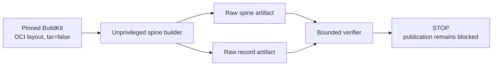

# Raw OCI release-spine format

The release spine is an internal transport for a bounded, two-platform OCI
descriptor graph. It lets a later job verify raw candidate bytes without
opening a tar, ZIP, gzip, or Docker archive in that job.

**Status: internal transport only.** The current CI check uses a generated
fixture. It does not build or publish a real Extra CODEOWNERS candidate. A
passing check proves this transport and verifier contract only. It does not
prove layer semantics, complete distribution evidence, signatures,
attestations, or publication safety.

The format has two files:

| File | Media type | Purpose |
| --- | --- | --- |
| `extra-codeowners-image-SOURCE_SHA.bin` | `application/vnd.stampbot.oci-release-spine.v1+octet-stream` | Concatenated, opaque OCI object bytes. |
| `extra-codeowners-image-SOURCE_SHA.spine.json` | `application/vnd.stampbot.oci-release-spine.v1+json` | Canonical identity, descriptor graph, and byte ranges. |

`SOURCE_SHA` is the exact lowercase 40-character source revision. Neither file
is a supported GitHub release asset.

## Boundary

The builder and verifier have deliberately different responsibilities:



The builder reads the small OCI index, manifest, and configuration JSON
objects. It verifies each object against the descriptor that selected it. OCI
layer bodies are never parsed; they are hashed and copied as opaque byte
ranges.

The verifier treats every OCI object body as opaque. It validates only the
small canonical record, the trusted workflow inputs, the exact byte ranges,
and their SHA-256 digests. Its production import and call surface excludes
archive parsers, process execution, network clients, and high-level archive or
file-opening helpers. It uses bounded `os.open`, `os.read`, and `os.pread`
operations directly. It checks that the record's descriptor graph is
internally consistent, but it does not reconstruct that graph from the opaque
index and manifest bodies.

## Trust anchors

Do not obtain a trusted value from the record it is meant to check. A consumer
must receive these values through its trusted workflow context or an
independently accepted job output:

| Value | Required source |
| --- | --- |
| Repository ID and name | GitHub workflow context. |
| Source revision and release version | Accepted release inputs and checked-out revision. |
| Workflow path, ref, and workflow SHA | GitHub workflow context. |
| Candidate registry, repository, and source-bound tag | The candidate-build plan. |
| Root OCI index digest | The pinned BuildKit or build-action digest output. Never `record.index.digest`. |
| Python proof artifact ID and provider/archive SHA-256 | The accepted Python distribution job outputs. |
| Application wheel and selection-record SHA-256 values | The accepted Python distribution job outputs. |
| Record and spine artifact SHA-256 values | The two raw upload-action outputs. |

The root digest is the candidate anchor. The builder requires the trusted
digest to equal the one descriptor in BuildKit's wrapper `index.json`. The
standalone verifier independently requires `record.index.digest` to equal that
same trusted value.

In the current CI transport check, the root digest comes from the synthetic
fixture generator. That proves the cross-job interface, not a real BuildKit
candidate. CI does not yet exercise compatibility with an actual BuildKit
`v0.30.0` `tar=false` layout. A future candidate workflow must replace the
fixture value with the digest returned by its pinned build action and add that
real-layout compatibility proof.

GitHub raw-artifact SHA-256 values are 64 lowercase hexadecimal characters.
OCI descriptor digests include the `sha256:` prefix.

## Accepted OCI layout

`build_release_spine.py` accepts one directory produced by the reviewed
BuildKit `v0.30.0` OCI-layout dialect with `tar=false`. It does not accept an
OCI archive or Docker archive.

The top-level directory contains exactly:

```text
blobs/
  sha256/
index.json
oci-layout
```

`oci-layout` contains only `imageLayoutVersion: "1.0.0"`. `blobs` contains only
the `sha256` directory, and that directory contains exactly the lowercase
digest-named objects reachable from the selected graph. Missing blobs, orphan
blobs, links, multiply linked files, and extra entries fail closed.

### BuildKit wrapper

The wrapper `index.json` is an OCI image index with exactly one descriptor. The
descriptor selects the trusted root OCI index and has exactly these
annotations:

- `io.containerd.image.name`, equal to
  `REGISTRY/REPOSITORY:release-candidate-SOURCE_SHA`
- `org.opencontainers.image.created`, matching the bounded
  `YYYY-MM-DDTHH:MM:SS[.fraction]Z` shape and numeric field ranges enforced by
  the builder (calendar validity is not established)
- `org.opencontainers.image.ref.name`, equal to
  `release-candidate-SOURCE_SHA`.

The wrapper descriptor's digest must equal the trusted build-action digest.

### Root index and platform manifests

The root index has depth one: it contains exactly two direct image-manifest
descriptors, and neither descriptor may select another index. Their order is:

1. `linux/amd64`
2. `linux/arm64`.

Docker media types, nested indexes, attestation descriptors, unknown fields,
additional platforms, and reordered platforms are rejected. Each platform
manifest has exactly one OCI configuration descriptor and between 1 and 64 OCI
gzip-layer descriptors.

Only these media types are accepted:

| Object | Media type |
| --- | --- |
| Index | `application/vnd.oci.image.index.v1+json` |
| Manifest | `application/vnd.oci.image.manifest.v1+json` |
| Configuration | `application/vnd.oci.image.config.v1+json` |
| Layer | `application/vnd.oci.image.layer.v1.tar+gzip` |

The media type is a descriptor contract, not permission to decode the body.
For example, the adversarial fixture labels bytes beginning with ZIP magic as
an OCI gzip layer. The builder and verifier retain those bytes unchanged.

Each configuration must match its platform and carry these exact values:

| Label | Required value |
| --- | --- |
| `org.opencontainers.image.revision` | Trusted source revision. |
| `org.opencontainers.image.version` | Trusted three-part version. |
| `org.stampbot.extra-codeowners.application-wheel.sha256` | Accepted application wheel SHA-256. |
| `org.stampbot.extra-codeowners.python-selection-record.sha256` | Accepted selection-record SHA-256. |

The two manifests may share a layer descriptor. A shared digest is stored once
in the spine and referenced by both platform records.

## Canonical record encoding

The record is UTF-8 JSON restricted to ASCII output. Its one accepted encoding
uses:

- lexicographically sorted object keys
- `,` and `:` without surrounding whitespace
- JSON string escapes produced with ASCII output enabled
- exactly one final line feed
- integers only; booleans are not integers for bounded fields.

Duplicate keys, byte-order marks, floats, non-finite numbers, invalid UTF-8,
alternate whitespace, carriage returns, missing final line feeds, unknown
fields, and oversized integers are rejected.

The top-level object has exactly these fields:

| Field | Contract |
| --- | --- |
| `schema_version` | Integer `1`. |
| `media_type` | `application/vnd.stampbot.oci-release-spine.v1+json`. |
| `repository` | Repository identity object. |
| `source` | Source revision and version object. |
| `workflow` | Workflow path, ref, and SHA object. |
| `candidate` | Candidate registry, repository, and tag object. |
| `python_distribution` | Accepted Python proof identities. |
| `spine` | Raw spine filename, media type, size, and SHA-256. |
| `index` | Trusted root OCI index descriptor. |
| `platforms` | Ordered `linux/amd64` and `linux/arm64` graph. |
| `objects` | Canonical byte-range inventory. |

### Identity objects

| Object | Exact fields |
| --- | --- |
| `repository` | `id`, `name` |
| `source` | `revision`, `version` |
| `workflow` | `path`, `ref`, `sha` |
| `candidate` | `registry`, `repository`, `tag` |
| `python_distribution` | `artifact_id`, `artifact_sha256`, `wheel_sha256`, `selection_record_sha256` |
| `spine` | `filename`, `media_type`, `size`, `sha256` |

Repository and artifact IDs are canonical positive decimal strings no greater
than `2^63 - 1`. The version has exactly three non-negative integer parts. The
candidate tag is exactly `release-candidate-SOURCE_SHA`.

The workflow path is under `.github/workflows/` and ends in `.yml` or `.yaml`.
The workflow ref is exactly
`OWNER/REPOSITORY/WORKFLOW_PATH@refs/{heads,tags,pull}/...`; it must bind the
same repository and path recorded in the other trusted fields. Its suffix may
contain ASCII letters, digits, `_`, `.`, `-`, and `/`. Empty, `.` and `..` path
segments are invalid.

### Scalar field bounds

The verifier applies the following exhaustive scalar rules. "ASCII" means the
complete value must contain ASCII characters only.

| Field | Type and accepted form | Maximum |
| --- | --- | --- |
| `schema_version` | Integer `1`; boolean is rejected | Exact value |
| `media_type` | Exact record media type | Exact value |
| `repository.id` | Positive canonical decimal string | 19 characters and `2^63 - 1` |
| `repository.name` | ASCII `OWNER/REPOSITORY`; letters, digits, `_`, `.`, and `-` | 512 characters |
| `source.revision` | Lowercase hexadecimal string | 40 characters exactly |
| `source.version` | ASCII `MAJOR.MINOR.PATCH` without leading zeroes | 64 characters |
| `workflow.path` | ASCII `.github/workflows/NAME.yml` or `.yaml` | 512 characters |
| `workflow.ref` | Bound repository/path plus `@refs/heads/...`, `@refs/tags/...`, or `@refs/pull/...`; empty, `.` and `..` segments rejected | 768 characters |
| `workflow.sha` | Lowercase hexadecimal string | 40 characters exactly |
| `candidate.registry` | Lowercase ASCII registry hostname | 253 characters |
| `candidate.repository` | Lowercase ASCII registry path with at least two slash-separated components; each component starts and ends with an alphanumeric character and may contain `.`, `_`, or `-` | 512 characters total; 128 per component |
| `candidate.tag` | Exact `release-candidate-SOURCE_SHA` | 255 characters |
| `python_distribution.artifact_id` | Positive canonical decimal string | 19 characters and `2^63 - 1` |
| `python_distribution.artifact_sha256` | Lowercase hexadecimal provider/archive digest | 64 characters exactly |
| `python_distribution.wheel_sha256` | Lowercase hexadecimal wheel digest | 64 characters exactly |
| `python_distribution.selection_record_sha256` | Lowercase hexadecimal record digest | 64 characters exactly |
| `spine.filename` | Exact `extra-codeowners-image-SOURCE_SHA.bin` | 255 characters |
| `spine.media_type` | Exact spine media type | Exact value |
| `spine.sha256` | Lowercase hexadecimal raw-file digest | 64 characters exactly |
| `spine.size` | Integer from 1 through 2 GiB; boolean is rejected | 2 GiB |
| Descriptor `digest` | Lowercase `sha256:` plus 64 hexadecimal characters | 71 characters exactly |
| Descriptor `media_type` | Exact media type for its kind | Exact value |
| Descriptor `size` | Positive integer; boolean is rejected | 4 MiB for JSON objects, 512 MiB for layers |
| Platform `architecture` | `amd64` or `arm64` in the required order | Exact value |
| Platform `os` | `linux` | Exact value |
| Object `kind` | `layer`, `config`, `manifest`, or `index` | Exact value |
| Object `offset` | Integer from zero through 2 GiB; boolean is rejected | 2 GiB |

### Descriptors and platforms

Every record descriptor has exactly:

| Field | Contract |
| --- | --- |
| `digest` | Lowercase `sha256:` OCI digest. |
| `media_type` | The one allowed media type for its object kind. |
| `size` | Positive bounded byte count. |

Each platform record has exactly `architecture`, `os`, `manifest`, `config`,
and `layers`. The manifest and configuration are descriptors. `layers` is the
ordered, non-empty descriptor list from that manifest.

### Byte-range objects

Each `objects` entry extends a descriptor with:

| Field | Contract |
| --- | --- |
| `kind` | `layer`, `config`, `manifest`, or `index`. |
| `offset` | Zero-based offset in the raw spine. |

Objects are sorted first by kind in this order:

```text
layer -> config -> manifest -> index
```

Objects of one kind are sorted by digest. Their ranges start at byte zero and
cover the spine exactly, with no prefix, gap, overlap, alias, or trailing byte.
Each digest appears once, even when both platforms share an object. Every
object is referenced by the index/platform graph, and every graph descriptor
has one matching object with the same kind, media type, digest, and size.

## Limits

| Input | Limit |
| --- | --- |
| Canonical record file | 256 KiB |
| JSON nesting depth | 8 |
| JSON values | 4,096 |
| Layers per platform | 64 |
| Spine objects | 160 |
| Index, manifest, or configuration object | 4 MiB |
| Layer object | 512 MiB |
| Complete spine | 2 GiB |
| Verification read chunk | 1 MiB |

JSON depth counts the top-level value as depth 1. Each value inside an object or
array increments the depth, including a scalar value. Depth 9 is rejected.

The record must describe exactly one index object, two manifest objects, and
two configuration objects. Shared layer objects are allowed.

## File and object-read rules

Builder inputs, the record, and the spine must be single-link regular files.
The scripts require `O_NOFOLLOW`, compare the opened descriptor with the path,
and recheck device, inode, mode, link count, ownership, size, modification time,
and change time after reading. Outputs use exclusive creation.

The builder parses each small metadata object from the same bytes it just
hashed. It does not hash one path and reopen that path for parsing. Layer and
spine copies are streamed and rehashed. Directory enumeration stops at each
caller's entry limit. After parsing the bounded descriptor graph, the builder
rejects an excessive unique-object count or aggregate spine size before it
reads any layer body.

The verifier reads the record once from one bounded descriptor. It then opens
the raw spine once, checks the complete file and every object in canonical
stream order, and keeps that descriptor open for a bounded consumer through
`open_verified_spine()`. `VerifiedSpine.object_chunks(DIGEST)` permits reads of
recorded objects only. Each call copies one object, capped at 512 MiB, into
private immutable chunks of at most 1 MiB. It verifies the complete object
digest before returning those chunks and does not reread the source after
exposing them. Retaining several snapshots increases memory use by their total
size. A future publisher must stage one object at a time and release each
snapshot before requesting another. The 512 MiB input bound is not a process
memory budget; the publisher's memory limit must also cover the interpreter,
chunk references, and upload client.

A future publisher must consume the already verified open descriptor. It must
publish only the authenticated chunks returned by `object_chunks()`, and it
must not verify a path and then reopen that path for publication. Uploading a
content-addressed object may happen inside the context, but the publisher must
not finalize a manifest, tag, release, or other reference until
`open_verified_spine()` exits successfully. That final check detects changes
elsewhere in the spine after its initial verification. This requirement is a
seam for issue
[#32](https://github.com/stampbot/extra-codeowners/issues/32); no current code
publishes a spine.

## Commands

Both production scripts use only the Python standard library. Inspect their
complete interfaces with:

```bash
python .github/scripts/build_release_spine.py --help
python .github/scripts/release_spine.py verify --help
```

The verifier requires the record and spine paths, both raw artifact SHA-256
values, and every trust-anchor field listed above. A successful command is
silent and exits zero. Any mismatch writes one bounded contract error to
standard error and exits non-zero.

## CI transport proof

The CI producer uploads the record and spine as two separate
`actions/upload-artifact@v7` artifacts with `archive: false`. It does not set an
artifact name: in raw mode, the source filename is the artifact name. The
producer exports each immutable artifact ID, each raw provider digest, and the
synthetic root index digest.

The consumer downloads each artifact separately by ID with
`actions/download-artifact@v8`, `skip-decompress: true`, and
`digest-mismatch: error`. It then runs the standalone verifier with the
out-of-band digests, trusted workflow identity, and internally consistent
record graph. Both jobs have only `contents: read`; they have no secret,
environment, OpenID Connect, package, attestation, release, or other write
authority.

## What this contract does not prove

A valid spine does not establish any of the following:

- that a layer is valid gzip or tar
- that the record graph was independently reconstructed from the opaque root
  index and manifest bodies
- that configuration `rootfs.diff_ids` match layer contents
- that a filesystem replay is safe or complete
- that notices, licenses, SBOMs, or corresponding source are complete
- that the selected Python proof is present inside each layer
- that a candidate was scanned or approved for release
- that a signature, attestation, provenance statement, or transparency-log
  entry exists
- that any registry, package, chart, GitHub release, or release asset may be
  published.

Those remain separate gates. The tagged release workflow remains structurally
blocked. Container-evidence source completeness remains false, and
`distribution_approval.approved` must remain false.
